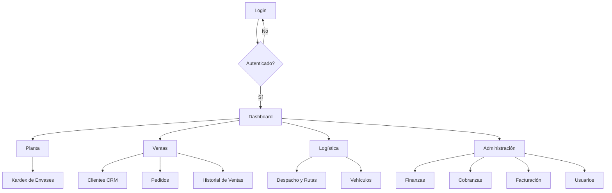
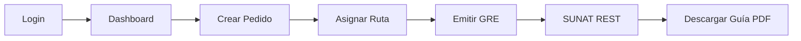
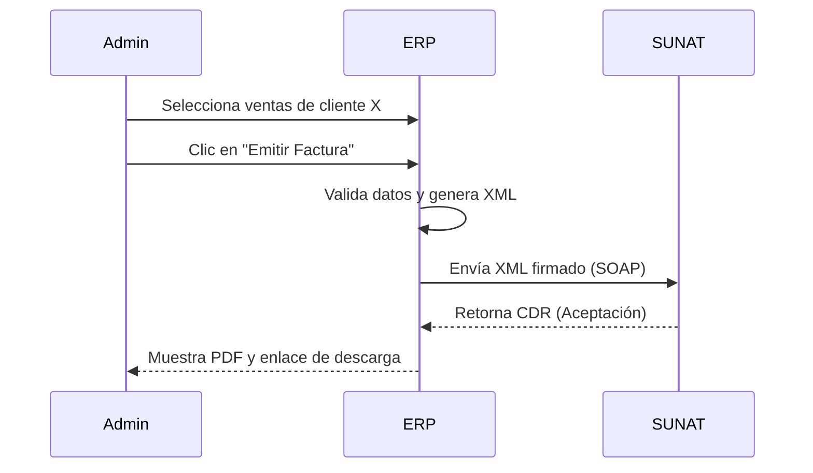
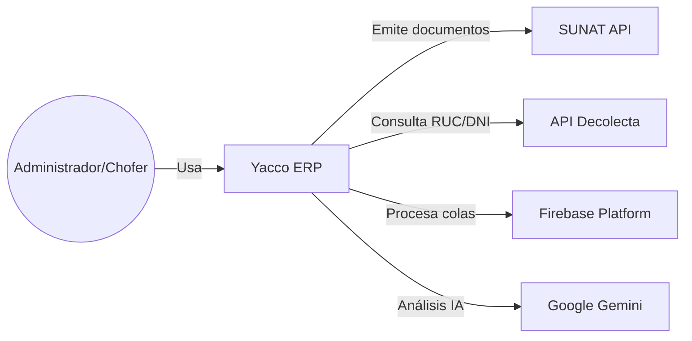
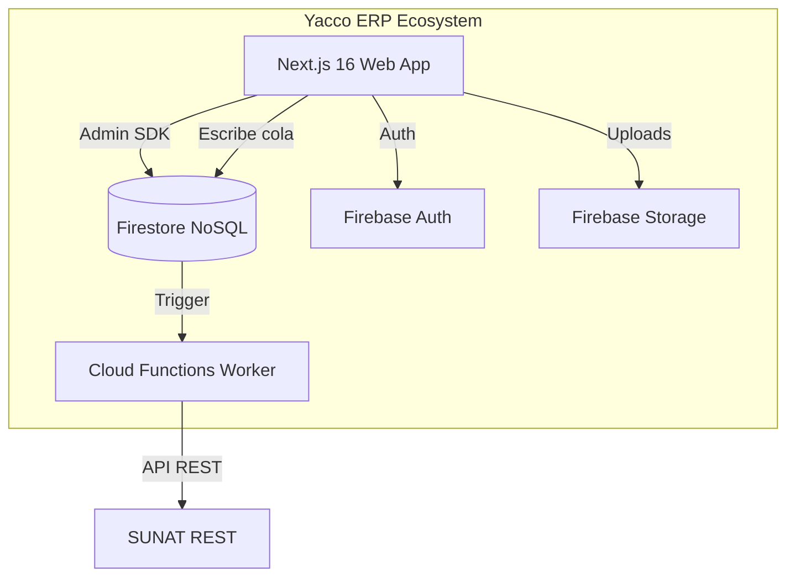
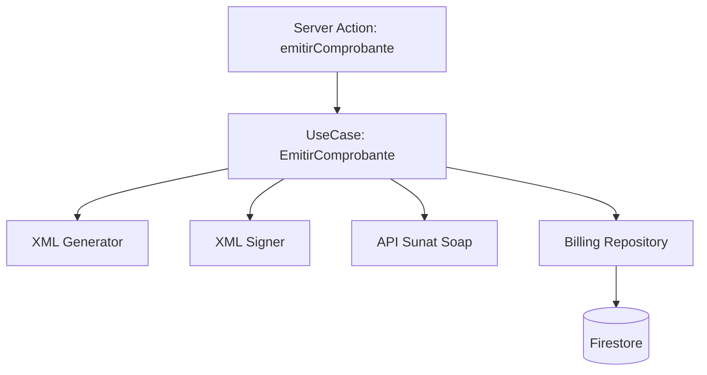
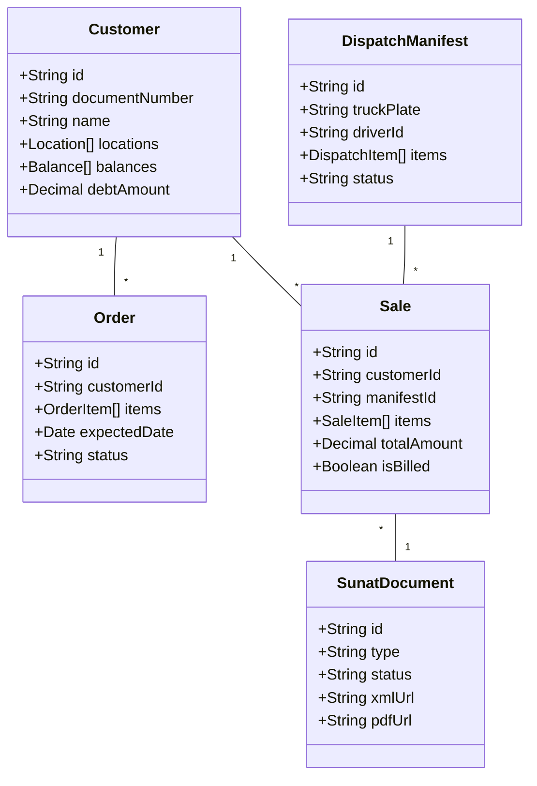
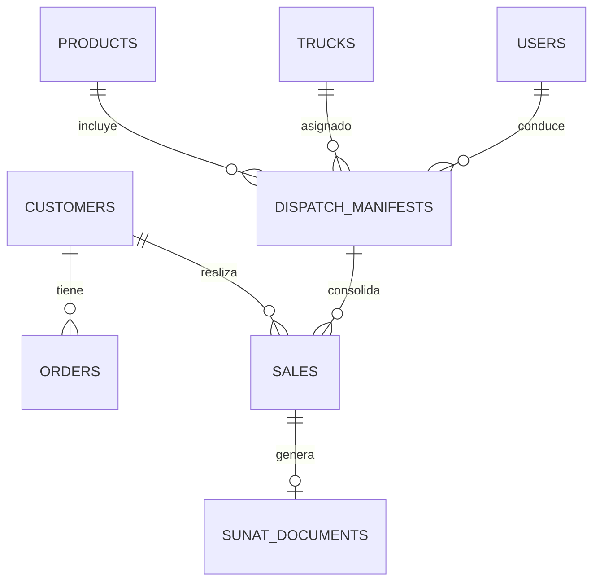

# Capítulo IV: Diseño del Producto

## 4.1 Style Guidelines

### 4.1.1 General
El diseño visual de Yacco ERP se alinea con la identidad corporativa de la industria de purificación de agua, utilizando una paleta de colores basada en tonalidades azules y grises industriales que transmiten limpieza, confianza y profesionalismo.

*   **Paleta de Colores (Basada en OKLCH/Tailwind 4):**
    *   **Primario:** Azul Profundo (`oklch(0.205 0 0)`), utilizado en el Sidebar y elementos de marca.
    *   **Fondo:** Blanco Puro (`oklch(1 0 0)`), para maximizar la legibilidad en entornos de alta luminosidad (planta).
    *   **Destructivo:** Rojo Alerta (`oklch(0.577 0.245 27.325)`), para acciones irreversibles.
*   **Tipografía:** Se utiliza la fuente **Geist Sans** (Sans-serif) para el cuerpo del texto y encabezados, optimizada para legibilidad en pantallas de diversos tamaños.
*   **Tono de Marca:** Industrial, eficiente y directo. La interfaz evita elementos decorativos innecesarios para centrarse en la operatividad.

### 4.1.2 Web Components
El sistema utiliza la biblioteca **shadcn/ui**, basada en componentes accesibles y minimalistas:
*   **Botones:** Con estados claros de *hover*, *active* y *disabled*. Variantes de color según la intención (primary, secondary, destructive).
*   **Inputs:** Campos de texto con validación visual inmediata y soporte para lectura de códigos de barras mediante periféricos.
*   **Tablas:** Tablas densas con soporte para ordenamiento, filtrado y paginación para gestionar grandes listados de ventas y clientes.
*   **Cards:** Utilizadas para resúmenes de indicadores (KPIs) en el Dashboard y detalles de pedidos.
*   **Sheets/Modals:** Empleados para formularios de registro rápido sin perder el contexto de la pantalla principal.

### 4.1.3 Mobile Guidelines
**N/A.** El sistema no cuenta con una aplicación nativa para iOS o Android; se despliega como una aplicación web responsiva optimizada para navegadores móviles.

---

## 4.2 Information Architecture

### 4.2.1 Organization Systems
La arquitectura de información se organiza de forma jerárquica y funcional, agrupando las operaciones por áreas de negocio:
*   **Principal:** Visión general del sistema (Dashboard).
*   **Planta y Producción:** Control de existencias físicas y envases (Kardex).
*   **Ventas y Clientes:** Gestión de la relación con el cliente (CRM, Pedidos, Ventas).
*   **Logística y Flota:** Gestión de la operación en campo (Despacho, Camiones).
*   **Administración y Caja:** Control financiero y tributario (Finanzas, Facturación, Usuarios).

### 4.2.2 Labeling Systems
Se utiliza una terminología técnica y de dominio consistente en todo el sistema:
*   **Facturación:** "Comprobante", "Boleta", "Factura", "SUNAT".
*   **Logística:** "Manifiesto", "Ruta", "Liquidación", "Placa".
*   **CRM:** "Ubigeo", "Saldo de Envases", "RUC/DNI".

### 4.2.3 SEO / Meta Tags
**N/A.** Al ser un sistema ERP de acceso restringido mediante autenticación, el SEO no es un requerimiento. Se han configurado meta-tags mínimos para la visualización correcta del icono en el escritorio (PWA básica).

### 4.2.4 Searching Systems
El sistema integra servicios de búsqueda optimizados (con soporte para Algolia en módulos críticos):
*   **Búsqueda de Clientes:** Por nombre, RUC o dirección.
*   **Búsqueda de Productos:** Por SKU o categoría.
*   **Búsqueda de Vehículos:** Por placa o alias.

### 4.2.5 Navigation Systems
El sistema utiliza un **Sidebar persistente** en desktop y un **Menú tipo Sheet** en dispositivos móviles. La navegación está protegida por un Proxy de seguridad que redirige al usuario según su rol.

---

## 4.6 Web Applications UX/UI Design

### 4.6.1 Wireframes
*   **Dashboard:** Layout de 3 columnas con KPIs superiores, gráficos de tendencia en el centro y listado de stock bajo a la derecha. [MOCKUP PLACEHOLDER]
*   **Gestión de Pedidos:** Tabla de ancho completo con filtros laterales y acciones rápidas para "Asignar a Ruta". [MOCKUP PLACEHOLDER]
*   **Facturación:** Panel de consolidación con selección de múltiples ventas y pre-visualización de totales antes de emitir a SUNAT. [MOCKUP PLACEHOLDER]

### 4.6.2 Wireflow Diagrams

### 4.6.3 Mock-ups
| Pantalla | Descripción | Link Figma |
| :--- | :--- | :--- |
| Login | Interfaz limpia con logo central y campos de credenciales. | [PLACEHOLDER] |
| Dashboard | Panel con gráficos de Recharts y KPIs operativos. | [PLACEHOLDER] |
| CRM | Listado de clientes con mapa de ubicaciones integrado. | [PLACEHOLDER] |
| Facturación | Panel de control de documentos electrónicos y estados SUNAT. | [PLACEHOLDER] |

### 4.6.4 User Flow Diagrams

#### Rol: Administrador

---

## 4.8 Domain-Driven Software Architecture

### 4.8.1 Context Diagram (C4 Nivel 1)

### 4.8.2 Container Diagram (C4 Nivel 2)

### 4.8.3 Components Diagram (C4 Nivel 3 - Facturación)

---

## 4.9 Software Object-Oriented Design

### 4.9.1 Class Diagrams

### 4.9.2 Class Dictionary

| Entidad | Atributo | Tipo | Descripción |
| :--- | :--- | :--- | :--- |
| **Customer** | `documentNumber` | String | RUC o DNI del cliente. |
| **Order** | `status` | Enum | PENDING, ASSIGNED, DELIVERED, CANCELLED. |
| **Sale** | `totalAmount` | Decimal | Monto total de la venta incluyendo IGV. |
| **DispatchManifest** | `truckPlate` | String | Placa del vehículo asignado a la ruta. |
| **SunatDocument** | `type` | String | 01 (Factura), 03 (Boleta), 09 (GRE). |

---

## 4.10 Database Design

### 4.10.1 Diagrama de Base de Datos (Firestore)
Aunque Firestore es una base de datos NoSQL documental, se presenta a continuación el modelo de relaciones lógicas mediante referencias por ID.

