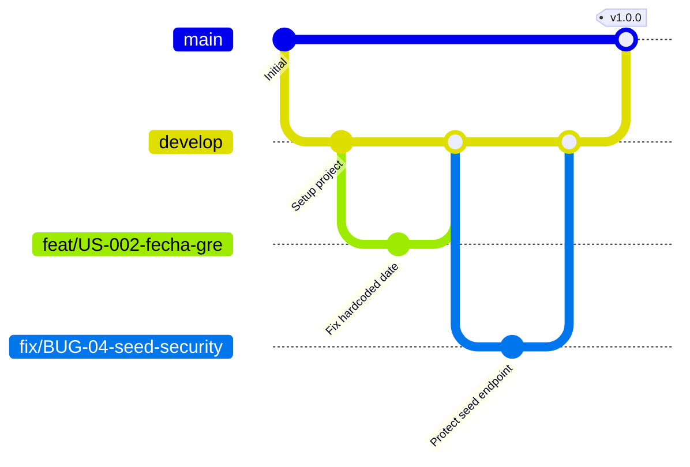
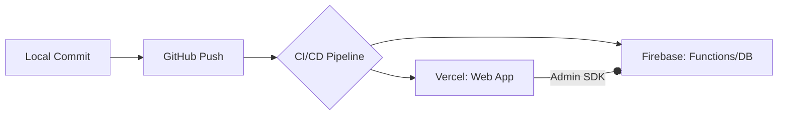

# Capítulo V: Implementación

## 5.1 Software Configuration Management

### 5.1.1 Dev Environment Config
El entorno de desarrollo de Yacco ERP ha sido estandarizado para garantizar la paridad entre los puestos de trabajo de los desarrolladores y los entornos de ejecución en la nube.

| Herramienta | Versión | Propósito |
| :--- | :--- | :--- |
| **Node.js** | 20.x (LTS) | Runtime principal del servidor y herramientas de build. |
| **npm** | 10.x+ | Gestor de paquetes y ejecución de scripts. |
| **TypeScript** | 5.x | Lenguaje de programación con tipado estático. |
| **Next.js** | 16.2.6 (App Router) | Framework React para la aplicación web full-stack. |
| **Firebase CLI** | 13.x+ | Gestión de servicios cloud (Hosting, Firestore, Functions). |
| **Firebase Emulators** | - | Pruebas locales de base de datos, auth y funciones. |

**Scripts Principales (`package.json`):**
*   `npm run dev`: Inicia el servidor de desarrollo de Next.js.
*   `npm run build`: Genera el bundle optimizado para producción.
*   `npm run emulate`: Inicia simultáneamente los emuladores de Firebase y Next.js.

### 5.1.2 Source Code Management
Se utiliza **Git** como sistema de control de versiones, siguiendo una estrategia de ramificación basada en *GitFlow* simplificado para despliegue continuo.

*   **Ramas principales:**
    *   `main`: Rama de producción protegida. Contiene código estable y desplegado.
    *   `develop`: Rama de integración donde se consolidan las nuevas funcionalidades.
*   **Ramas temporales:**
    *   `feat/US-XXX-nombre`: Para nuevas historias de usuario.
    *   `fix/BUG-XX-nombre`: Para corrección de errores críticos.

### 5.1.3 Source Code Style Guide & Conventions
El equipo se rige por las normas detalladas en `docs/CONTRIBUTING.md`. Los puntos clave incluyen:
*   **Arquitectura Limpia:** Separación estricta entre `core/entities` (dominio) y `services/repositories` (infraestructura).
*   **Server Actions Pattern:** Uso de `"use server"` con validación obligatoria vía Zod.
*   **Tipado Estricto:** Prohibición del uso de `any` sin justificación técnica y comentario de TODO.
*   **Naming:** `PascalCase` para componentes React y `camelCase` para funciones y servicios.

### 5.1.4 Deployment Config
El despliegue está automatizado mediante un pipeline de CI/CD que integra Vercel y Firebase.

*   **Vercel:** Aloja la aplicación web Next.js (App Router).
*   **Firebase:** Provee la base de datos (Firestore), almacenamiento de archivos (Storage) y procesos de fondo (Cloud Functions).
*   **Pipeline:**
    1.  Push a `develop` o `main`.
    2.  Ejecución de `npm run build` en Vercel.
    3.  Validación de variables de entorno (Secretos).
    4.  Despliegue de Cloud Functions vía Firebase CLI.

---

## 5.2 Implementation por Sprint

### 5.2.1 Sprint 1: Estabilización y Seguridad
*   **Sprint Planning:**
    *   **Objetivo:** Eliminar riesgos tributarios y brechas de seguridad críticas.
    *   **Capacidad:** 8 Story Points (SP).
    *   **Historias:** US-002, US-003, US-004, US-005.
*   **Sprint Backlog:**
    | ID | Tarea Técnica | SP | Estado |
    | :--- | :--- | :---: | :---: |
    | US-002 | Reemplazar fecha hardcodeada por `new Date()` en GRE. | 1 | Finalizado |
    | US-003 | Implementar bloqueo de `/api/seed` en producción y validación de token. | 2 | Finalizado |
    | US-004 | Extraer URLs de SUNAT a variables de entorno (.env). | 2 | Pendiente |
    | US-005 | Implementar logger estructurado y filtrar datos sensibles. | 3 | Pendiente |
*   **Development Evidence:** [EVIDENCIA PLACEHOLDER: Captura de commits US-002/003]
*   **Execution Evidence:** [EVIDENCIA PLACEHOLDER: Captura de pantalla 404 en /api/seed en producción]
*   **Software Deployment Evidence:** [EVIDENCIA PLACEHOLDER: Panel de Vercel con logs de build]

### 5.2.2 Sprint 2: Worker SUNAT Real
*   **Sprint Planning:**
    *   **Objetivo:** Lograr que la emisión de guías de remisión sea real ante SUNAT.
    *   **Historias:** US-201, US-202.
    *   **Capacidad comprometida:** 16 SP.
*   **Sprint Backlog:**
    | ID | Tarea Técnica | SP | Estado |
    | :--- | :--- | :---: | :---: |
    | US-201 | Configurar npm workspaces y paquete `sunat-core`. | 8 | Pendiente |
    | US-202 | Conectar Cloud Function con API REST de SUNAT. | 8 | Pendiente |
*   **Services Documentation Evidence:** Se documentó la integración con la API REST de SUNAT para Guías de Remisión (GRE) usando OAuth2. [EVIDENCIA PLACEHOLDER: Captura de logs de Cloud Functions enviando GRE]

### 5.2.3 Sprint 3: Calidad y Testing
*   **Sprint Planning:**
    *   **Objetivo:** Asegurar la integridad de los generadores XML y el monitoreo de estados.
    *   **Historias:** US-203, US-301, US-302.
    *   **Capacidad comprometida:** 13 SP.
*   **Testing Suite Evidence:** [EVIDENCIA PLACEHOLDER: Captura de `npm test` con Vitest pasando tests de XML]

### 5.2.4 Sprint 4: Refactor Clean Architecture
*   **Sprint Planning:**
    *   **Objetivo:** Desacoplar la lógica de negocio de los componentes de UI y Server Actions.
    *   **Historias:** US-101, US-102, US-105.
    *   **Capacidad comprometida:** 16 SP.
*   **Execution Evidence:** [EVIDENCIA PLACEHOLDER: Captura de pantalla del panel de facturación consolidada]

---

## 5.3 Validation Interviews

### 5.3.1 Diseño de entrevista de validación
Objetivo: Evaluar si el sistema Yacco ERP resuelve los dolores operativos identificados en el Capítulo II.

1. ¿Qué tan sencillo le resultó encontrar la opción para emitir una factura de una venta anterior?
2. En una escala del 1 al 5, ¿cuánto tiempo cree que ahorra con la generación automática de la Guía de Remisión?
3. ¿Tuvo alguna confusión al momento de registrar el retorno de envases vacíos?
4. ¿Considera que la información mostrada en el Dashboard es suficiente para el cierre de caja diario?
5. ¿Qué opina de la velocidad de respuesta del sistema al interactuar con SUNAT?
6. Si tuviera que eliminar una funcionalidad por ser compleja, ¿cuál sería?
7. ¿Se siente seguro de que el sistema cumple con las normativas tributarias actuales?

### 5.3.2 Registro de entrevistas
| Usuario | Rol | Resultado | Link |
| :--- | :--- | :--- | :--- |
| [PLACEHOLDER 23] | Administrador | [PLACEHOLDER 24] | [PLACEHOLDER 25] |
| [PLACEHOLDER 26] | Chofer | [PLACEHOLDER 27] | [PLACEHOLDER 28] |

### 5.3.3 Evaluación de Heurísticas de Nielsen
| Heurística | Hallazgo | Severidad (0-4) |
| :--- | :--- | :---: |
| 1. Visibilidad del estado del sistema | Barra de progreso real en la emisión a SUNAT. | 0 |
| 2. Relación sistema vs mundo real | Uso de términos como "Bidón" y "Ubigeo". | 0 |
| 3. Control y libertad del usuario | Botón de "Anular" antes de enviar a SUNAT. | 1 |
| 4. Consistencia y estándares | Uso consistente de shadcn/ui en todos los módulos. | 0 |
| 5. Prevención de errores | Bloqueo de facturación si el RUC es inválido. | 0 |
| 6. Reconocimiento antes que recuerdo | Menú lateral siempre visible con iconos claros. | 0 |
| 7. Flexibilidad y eficiencia | Atajos de teclado en el buscador de productos. | 1 |
| 8. Estética y diseño minimalista | Interfaz industrial, sin distracciones. | 0 |
| 9. Ayuda y recuperación | Mensajes de error de SUNAT traducidos a lenguaje humano. | 1 |
| 10. Ayuda y documentación | [PLACEHOLDER: Hallazgo en sección de ayuda] | 2 |

---

## 5.4 Video About-the-Product
[PLACEHOLDER: Link al video en YouTube/Drive]

### Storyboard sugerido:
1.  **Escena 1 (Problema):** El administrador Gerardo rodeado de papeles y cuadernos, estresado por el cierre de caja.
2.  **Escena 2 (Solución):** Introducción de Yacco ERP. Gerardo abre la aplicación en su laptop.
3.  **Escena 3 (Demo Facturación):** Demo de consolidación de 3 ventas en una sola factura con 1 clic.
4.  **Escena 4 (Demo Logística):** El chofer Raúl en su camión abriendo la GRE en su tablet.
5.  **Escena 5 (Impacto):** Gerardo y Raúl finalizando la jornada a tiempo, con caja cuadrada y SUNAT al día.
