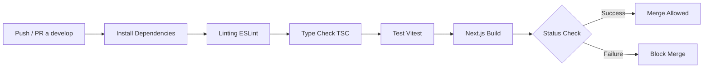
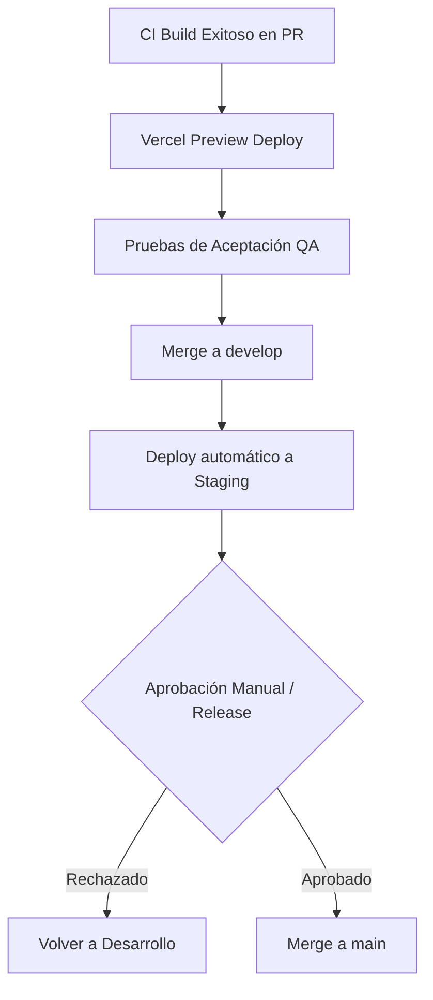
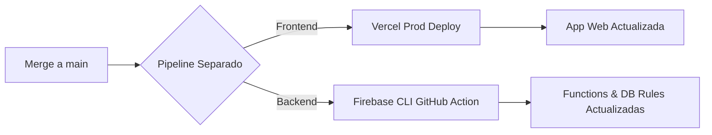
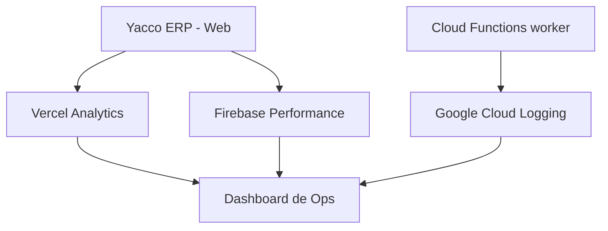
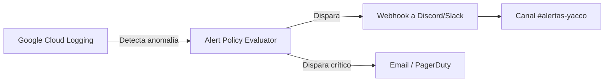

# Capítulo VII: DevOps y Operaciones

## 7.1 Continuous Integration

### 7.1.1 Tools and Practices
La integración continua (CI) asegura que el código principal permanezca en un estado desplegable. El flujo se basa en un modelo *Trunk-based* adaptado, utilizando `develop` como rama principal de integración antes de pasar a `main`.

*   **Herramienta:** GitHub Actions [VERIFICAR].
*   **Trigger:** Push o Pull Request hacia las ramas `develop` y `main`.
*   **Prácticas automatizadas:**
    1.  **Linting:** Ejecución de `eslint` (usando `eslint-config-next`) para garantizar convenciones de código.
    2.  **Type-checking:** Verificación estricta de tipos de TypeScript (`tsc --noEmit`).
    3.  **Testing:** Ejecución de la suite de pruebas unitarias con Vitest (referencia a la historia **US-301**).
    4.  **Build:** Compilación de la aplicación Next.js (`npm run build`) para detectar errores de sintaxis o empaquetado.

### 7.1.2 Build & Test Suite Pipeline Components
A continuación, el diagrama del pipeline de integración continua:



**Ejemplo propuesto del Workflow CI (`.github/workflows/ci.yml`):**
```yaml
name: CI Pipeline

on:
  push:
    branches: [ "develop", "main" ]
  pull_request:
    branches: [ "develop", "main" ]

jobs:
  build-and-test:
    runs-on: ubuntu-latest
    steps:
      - uses: actions/checkout@v4
      
      - name: Setup Node.js
        uses: actions/setup-node@v4
        with:
          node-version: '20'
          cache: 'npm'
          
      - name: Install dependencies
        run: npm ci
        
      - name: Lint
        run: npm run lint
        
      - name: Type Check
        run: npx tsc --noEmit
        
      - name: Test
        run: npm test # Asume configuración de Vitest
        
      - name: Build Next.js
        run: npm run build
```
[EVIDENCIA PLACEHOLDER 40: Captura de la corrida exitosa de GitHub Actions en un PR]

---

## 7.2 Continuous Delivery

### 7.2.1 Tools and Practices
La entrega continua (CD - Delivery) automatiza el despliegue del código hacia entornos previos a producción, permitiendo pruebas manuales y validación de Stakeholders.

*   **Hosting Frontend:** Vercel [VERIFICAR]. Genera *Preview Deployments* automáticos por cada Pull Request.
*   **Backend:** Firebase CLI ejecutado mediante GitHub Actions para desplegar reglas de Firestore y Cloud Functions en el entorno de *Staging*.
*   **Gate de Aprobación:** El pase a producción (rama `main`) requiere un *Code Review* aprobado y validación manual del Product Owner.

### 7.2.2 Stages Deployment Pipeline Components


[EVIDENCIA PLACEHOLDER 41: Capturas de panel de Vercel mostrando Preview Deployments]

---

## 7.3 Continuous Deployment

### 7.3.1 Tools and Practices
El despliegue continuo (CD - Deployment) automatiza la salida a producción una vez que el código se fusiona a `main`.

*   **Frontend (Vercel):** Configurado para realizar un "Auto-deploy" directo al entorno de Producción al detectar cambios en `main`.
*   **Backend (Firebase):** Una GitHub Action independiente despliega las Cloud Functions (`firebase deploy --only functions`) y sincroniza los índices/reglas de Firestore.
*   **Rollback Strategy:** Vercel permite regresiones instantáneas a versiones anteriores desde su panel (Instant Rollback).
*   **Migraciones:** Las reglas de seguridad (`firestore.rules`) y los índices (`firestore.indexes.json`) se mantienen bajo control de versiones y se despliegan junto con las funciones.

### 7.3.2 Production Deployment Pipeline Components


*(Nota: A diferencia del Continuous Delivery donde hay un Gate manual, el Continuous Deployment a Producción es automático tras el merge a `main`).*

---

## 7.4 Continuous Monitoring

### 7.4.1 Tools and Practices
Dado el riesgo detectado en la dependencia crítica de SUNAT (latencia o caídas gubernamentales), el monitoreo es vital.

*   **Vercel Analytics:** Monitoreo del tráfico web, Web Vitals y errores de la aplicación de usuario.
*   **Firebase Crashlytics / Performance:** Trazabilidad de fallos en el cliente móvil/web y latencia en consultas a Firestore.
*   **Log estructurado:** Como se define en la historia **US-005**, los logs de las funciones (que envían comprobantes) se supervisarán desde el panel nativo de GCP/Firebase Logs.

### 7.4.2 Monitoring Pipeline Components



**Métricas Clave a Observar:**
1.  **Tasa de éxito SUNAT:** Proporción de comprobantes aceptados (status: `ACCEPTED`) vs rechazados (`REJECTED`).
2.  **Profundidad de la Cola:** Número de tareas en `sunatQueue` con estado `ERROR` o estancadas en `PROCESSING`.
3.  **Tiempo de respuesta REST/SOAP:** Latencia promedio de `apiSunatRest` al enviar GREs.

### 7.4.3 Alerting
Alineado con los riesgos técnicos del negocio, se proponen las siguientes alertas automáticas:

| Condición (Síntoma) | Umbral Crítico | Canal de Notificación |
| :--- | :--- | :--- |
| **Rechazos SUNAT (CDR 99)** | > 5% de documentos en 1 hora. | Alerta SMS / Slack (Canal #sunat-urgente) |
| **Cola de SUNAT atascada** | Tareas en `PENDING` por > 30 mins. | Slack / Email (Equipo de Dev) |
| **Errores de Red (Timeouts)** | > 10 fallos 5xx seguidos. | Slack (Equipo de Dev) |
| **Certificado Digital por vencer** | Menos de 30 días de vigencia. | Email a Gerencia y Soporte Técnico |

### 7.4.4 Notification Pipeline



> **Nota Técnica:** La implementación formal de este esquema de Monitoreo y Alertas no se encuentra actualmente en el `docs/BACKLOG.md`. Se recomienda la creación de una nueva Épica técnica ("Observabilidad") y una Historia de Usuario (ej. **US-701: Setup de Alertas SUNAT**) para abarcar este esfuerzo en un sprint posterior.
