# Capítulo I: Introducción

## 1.1 Startup Profile

### 1.1.1 Descripción de la Startup
**Embotelladora Moalv S.A.C.** (RUC: 20612769151) es una empresa peruana dedicada a la purificación y comercialización de agua potable envasada. Ubicada estratégicamente para atender el mercado local, la empresa se especializa en la distribución directa mediante una flota de unidades propias (despacho en ruta). Su modelo de negocio se basa en la rotación de envases retornables y la atención personalizada a clientes finales y establecimientos comerciales.

*   **Misión:** Proveer agua de la más alta calidad y pureza, garantizando la salud y bienestar de nuestros clientes a través de un servicio de distribución eficiente, puntual y transparente.
*   **Visión:** Consolidarse como la embotelladora líder en la región, reconocida por su excelencia operativa, innovación tecnológica en procesos de purificación y compromiso con la sostenibilidad mediante el control riguroso de envases retornables.

### 1.1.2 Perfiles del equipo
| Nombre | Rol | Fortalezas |
| :--- | :--- | :--- |
| [PLACEHOLDER 1] | Product Owner / CEO | [PLACEHOLDER 2] |
| [PLACEHOLDER 3] | Full-stack Developer | [PLACEHOLDER 4] |
| [PLACEHOLDER 5] | UI/UX Designer | [PLACEHOLDER 6] |
| [PLACEHOLDER 7] | QA Engineer | [PLACEHOLDER 8] |

---

## 1.2 Solution Profile

### 1.2.1 Antecedentes y problemática
La industria de embotellado de agua en el Perú enfrenta desafíos logísticos y tributarios críticos. Moalv S.A.C. identifica los siguientes puntos de dolor en su gestión actual:

1.  **Gestión Manual de Despacho:** El armado de rutas y el control de carga en camiones se realiza mediante procesos tradicionales, lo que genera errores en el inventario de salida y retorno.
2.  **Inconsistencia en Facturación Electrónica:** La dependencia de sistemas externos o procesos manuales para la emisión de Facturas, Boletas y Guías de Remisión (GRE) genera retrasos y posibles contingencias ante la SUNAT.
3.  **Control de Envases (Kardex):** La falta de un seguimiento digitalizado de los envases vacíos (retornables) entregados y recogidos resulta en pérdidas económicas significativas.
4.  **Conciliación de Cobranzas:** El registro de ventas en campo (efectivo, transferencias, créditos) no se sincroniza en tiempo real con la contabilidad central, dificultando la visibilidad del flujo de caja.

### 1.2.2 Lean UX

#### a. Problem Statements
El sistema actual de gestión de Embotelladora Moalv S.A.C. es ineficiente para escalar las operaciones de distribución en ruta. Los despachadores carecen de herramientas digitales para registrar ventas y retornos de envases en tiempo real, lo que causa una discrepancia del [PLACEHOLDER 9]% entre el inventario físico y los registros contables, además de exponer a la empresa a multas por emisión tardía de documentos electrónicos ante SUNAT.

#### b. Assumptions
*   **Usuarios:** Los choferes y auxiliares están dispuestos a usar una aplicación web en tablets/smartphones para registrar sus ventas.
*   **Valor:** El control automatizado de envases reducirá las pérdidas anuales por envases no retornados.
*   **Negocio:** La integración directa con SUNAT para GRE y Facturación reducirá el tiempo administrativo en un 50%.
*   **Tecnología:** Firebase proporciona la latencia necesaria para actualizaciones en tiempo real entre la planta y la ruta.

#### c. Hypothesis
Creemos que al implementar un sistema ERP web responsivo que centralice el despacho, el Kardex de envases y la facturación electrónica automatizada, lograremos reducir las discrepancias de inventario y los errores tributarios. Sabremos que hemos tenido éxito cuando el tiempo de liquidación de rutas al final del día se reduzca de horas a minutos y cuando el 100% de las ventas en ruta cuenten con un comprobante electrónico válido en el momento de la entrega.

#### d. Lean UX Canvas
1.  **Business Problem:** Gestión manual de rutas, pérdida de envases y facturación desincronizada.
2.  **Business Outcomes:** Reducción de merma de envases, liquidación de caja inmediata, cumplimiento tributario 100%.
3.  **Users:** Administradores de planta, Choferes de despacho, Personal contable.
4.  **User Benefits:** Menos carga administrativa, rutas optimizadas, soporte legal en cada entrega.
5.  **Solutions:** Módulo de Despacho, Kardex Digital, Integración API SUNAT REST/SOAP, Panel de Cobranzas.
6.  **Hypothesis:** (Ver sección c).
7.  **What’s the most important thing we need to learn first?:** ¿Es la interfaz lo suficientemente intuitiva para los choferes en condiciones de campo?
8.  **What’s the least amount of work we need to do to learn that next important thing?:** Implementar el módulo de "Liquidación de Ruta" y probarlo con un chofer real durante una semana.

---

## 1.3 Segmentos objetivo
El proyecto está diseñado primariamente para **Embotelladora Moalv S.A.C.**, operando en el sector B2B y B2C de purificación de agua. Sin embargo, la solución es altamente escalable para:
*   Pequeñas y medianas embotelladoras de agua potable en el territorio peruano.
*   Distribuidoras mayoristas de bebidas que operen con modelos de envases retornables.
*   Empresas de servicios logísticos "última milla" que requieran integración tributaria inmediata en Perú.


\newpage

# Capítulo II: Requerimientos

## 2.1 Competidores

### 2.1.1 Análisis competitivo
A continuación, se presenta una comparativa entre Yacco ERP y las soluciones de facturación y gestión comercial más relevantes en el mercado peruano.

| Característica | Yacco ERP | Nubefact | Bsale | Sitemype |
| :--- | :--- | :--- | :--- | :--- |
| **Foco de Mercado** | Embotelladoras de agua | API Facturación (General) | Retail y POS | PYMEs (General) |
| **Facturación Electrónica (CPE)** | Sí (UBL 2.1) | Sí (Líder API) | Sí | Sí |
| **Guía de Remisión (GRE)** | Sí (Integrada a Ruta) | Sí (Solo API) | Sí | Sí |
| **Control de Envases (Kardex)** | Sí (Especializado) | No | No | No |
| **Gestión de Rutas/Manifiestos** | Sí (Core del sistema) | No | No | Parcial [VERIFICAR] |
| **Cobranzas en Ruta** | Sí (Multi-método) | No | No | No |
| **Modelo de Precios** | [VERIFICAR] | SaaS por volumen | SaaS mensual | SaaS mensual |

### 2.1.2 Estrategias/tácticas frente a competidores
Yacco ERP no busca competir como un facturador genérico, sino como una **solución de última milla especializada**. Nuestra principal ventaja competitiva reside en el **Kardex de Envases Retornables**, una funcionalidad crítica para las embotelladoras que las soluciones generalistas ignoran. Mientras que un competidor requiere que el usuario emita documentos de forma aislada, Yacco vincula la carga del camión (Manifiesto) con la emisión automática de GRE y la liquidación de cobranzas, reduciendo la fricción operativa que genera el uso de múltiples herramientas desvinculadas.

---

## 2.2 Entrevistas

### 2.2.1 Diseño de entrevistas
El objetivo es validar los dolores operativos y las expectativas de cumplimiento tributario.

#### a. Guion para Dueño/Administrador (Segmento Estratégico)
1. ¿Cómo realiza actualmente el seguimiento de las ventas diarias de sus repartidores?
2. ¿Qué tan difícil le resulta saber cuántos envases vacíos tiene cada cliente en su poder?
3. ¿Cuánto tiempo le toma al día emitir las facturas y guías de remisión de todos sus despachos?
4. ¿Ha tenido problemas o multas con SUNAT por errores en la emisión de documentos?
5. ¿Cómo gestiona las cuentas por cobrar de los clientes que compran al crédito?
6. ¿Cómo verifica que lo recaudado en efectivo por el chofer coincida con lo vendido?
7. Si pudiera automatizar una sola tarea de su gestión administrativa, ¿cuál sería?
8. ¿Qué reporte le resultaría más útil para tomar decisiones de crecimiento?

#### b. Guion para Chofer/Repartidor (Segmento Operativo)
1. ¿Cómo sabe qué clientes debe visitar y cuántos bidones debe entregar a cada uno?
2. ¿Qué hace cuando un cliente le pide una factura o boleta en el momento de la entrega?
3. ¿Cómo registra los envases vacíos que recoge de los clientes?
4. ¿Qué es lo que más tiempo le quita durante su ruta de reparto?
5. ¿Cómo reporta los pagos recibidos (efectivo, Yape, transferencias) al final del día?
6. ¿Alguna vez ha tenido problemas con la policía o inspectores por no tener la Guía de Remisión a la mano?
7. ¿Cómo maneja los cambios de precio de último minuto con clientes especiales?
8. ¿Qué tan cómodo se siente usando aplicaciones en su celular durante el trabajo?

### 2.2.2 Registro de entrevistas
| Entrevistado | Cargo | Fecha | Resumen de hallazgos | Link Recurso |
| :--- | :--- | :--- | :--- | :--- |
| [PLACEHOLDER 10] | [PLACEHOLDER 11] | [PLACEHOLDER 12] | [PLACEHOLDER 13] | [PLACEHOLDER 14] |
| [PLACEHOLDER 15] | [PLACEHOLDER 16] | [PLACEHOLDER 17] | [PLACEHOLDER 18] | [PLACEHOLDER 19] |

### 2.2.3 Análisis de entrevistas
[PLACEHOLDER 20: Análisis consolidado de patrones y discrepancias entre los entrevistados].

---

## 2.3 Needfinding

### 2.3.1 User Personas

#### Persona 1: El Administrador (Gerardo)
*   **Foto:** [PLACEHOLDER 21]
*   **Perfil:** Dueño o administrador de la planta, 45 años.
*   **Metas:** Cumplimiento tributario total, cero pérdida de envases, control de caja diario.
*   **Frustraciones:** Errores en Excel, falta de visibilidad de los camiones en ruta, demora en liquidar el día.
*   **Contexto:** Trabaja desde una oficina en planta, usa laptop y revisa reportes por la noche.

#### Persona 2: El Chofer Repartidor (Raúl)
*   **Foto:** [PLACEHOLDER 22]
*   **Perfil:** Repartidor con 5 años de experiencia, 30 años.
*   **Metas:** Terminar su ruta rápido, no tener descuadres de dinero, evitar problemas legales (GRE).
*   **Frustraciones:** Cargar papeles físicos, hacer cálculos mentales de vueltos, olvidar anotar envases recogidos.
*   **Contexto:** Siempre en movimiento, usa smartphone con guantes, trabaja bajo presión de tiempo.

### 2.3.2 User Task Matrix
| Tarea | Administrador | Chofer | Frecuencia | Importancia |
| :--- | :---: | :---: | :--- | :--- |
| Configurar precios/productos | X | | Baja | Alta |
| Asignar pedidos a ruta | X | | Diaria | Crítica |
| Emitir Guía de Remisión (GRE) | X | | Diaria | Crítica |
| Registrar venta en ruta | | X | Muy Alta | Crítica |
| Cobrar (Efectivo/Digital) | | X | Muy Alta | Alta |
| Registrar retorno de envases | | X | Muy Alta | Crítica |
| Liquidar caja del día | X | X | Diaria | Alta |

### 2.3.3 User Journey Mapping (As-Is)
*   **Fase 1: Preparación.** El admin anota pedidos en papel/WhatsApp. El chofer carga el camión "al ojo".
*   **Fase 2: En Ruta.** El chofer visita clientes, si piden factura, debe llamar a la oficina. Emociones: Estrés.
*   **Fase 3: Transacción.** Cobro manual, anotación en cuaderno. Riesgo: Error en suma o pérdida de dinero.
*   **Fase 4: Cierre.** Regreso a planta a las 7 PM. El admin y el chofer pasan 1 hora cuadrando envases y dinero.

### 2.3.4 Empathy Mapping (Chofer)
*   **¿Qué ve?** Tráfico, papeles arrugados, clientes apurados.
*   **¿Qué oye?** Quejas por demoras, el ruido del motor.
*   **¿Qué dice/hace?** "Mañana te traigo el comprobante", cuenta dinero rápido.
*   **¿Qué siente?** Preocupación por perder envases que luego le descuentan de su sueldo.

### 2.3.5 As-is Scenario Mapping
1. **Entrada:** Pedido por teléfono.
2. **Proceso:** Anotación en bitácora física -> Carga de camión -> Salida sin Guía Electrónica (o guía manual).
3. **Salida:** Entrega -> Pago -> Anotación en cuaderno.
4. **Feedback:** Cuadre manual al final del día con discrepancias frecuentes.

---

## 2.4 Ubiquitous Language
*   **SUNAT:** Superintendencia Nacional de Aduanas y de Administración Tributaria.
*   **RUC:** Registro Único de Contribuyente (11 dígitos).
*   **GRE (Tipo 09):** Guía de Remisión Remitente, obligatoria para trasladar bidones.
*   **CDR:** Constancia de Recepción de SUNAT (valida el documento).
*   **UBL 2.1:** Estándar XML para comprobantes electrónicos en Perú.
*   **Ubigeo:** Código de 6 dígitos para identificar distritos (vital para GRE).
*   **Manifiesto/Despacho:** Documento que agrupa la carga y ruta de un camión.
*   **Liquidación:** Proceso de cierre donde se cuadra dinero, ventas y envases al volver de ruta.
*   **Bidón:** Unidad principal de producto (20L o 7L).
*   **Envase prestado:** Saldo de envases que el cliente tiene y debe devolver.
*   **Ruta de Reparto:** Secuencia de clientes asignada a un camión.


\newpage

# Capítulo III: Especificación de Requerimientos

## 3.1 To-Be Scenario Mapping

A diferencia de la gestión manual documentada en el "As-is", la implementación de Yacco ERP transforma el flujo de valor mediante la automatización y centralización de datos.

### Escenario A: Emisión masiva de comprobantes (Administrador)
*   **Fase 1: Preparación.** Al finalizar el día, el administrador (Gerardo) accede al panel de facturación donde el sistema ya ha consolidado todas las ventas con estado "No facturado".
*   **Fase 2: Acción.** Selecciona múltiples ventas de un mismo cliente (ej. corporativo) y hace clic en "Emitir Comprobante".
*   **Fase 3: Ejecución del Sistema.** El ERP (mediante su arquitectura limpia) agrupa los productos, calcula el IGV, genera el XML en estándar UBL 2.1, lo firma digitalmente y lo envía a la API SOAP de SUNAT en menos de 3 segundos.
*   **Mejora vs As-is:** Reducción del tiempo de emisión de horas a segundos. Eliminación del 100% de errores de tipeo o cálculos manuales de impuestos.

### Escenario B: Despacho automatizado con GRE (Chofer)
*   **Fase 1: Preparación.** El administrador arma la ruta en el sistema y asigna los pedidos a un camión (Manifiesto).
*   **Fase 2: Ejecución del Sistema (Background).** Un *worker* en Cloud Functions detecta la asignación y, de manera asíncrona, genera la Guía de Remisión Remitente (GRE), la envía a la API REST de SUNAT y guarda el ticket.
*   **Fase 3: Acción.** El chofer (Raúl) abre su aplicación web en la tablet antes de salir de la planta y ya tiene el PDF de la GRE válida con su código QR.
*   **Mejora vs As-is:** Garantiza el cumplimiento legal antes de que el camión encienda el motor, previniendo decomisos y agilizando la salida de planta.

---

## 3.2 User Stories

Las historias de usuario han sido derivadas del backlog técnico y estructuradas bajo el formato académico estándar.

### Épica E-01: Estabilización y seguridad
| ID | Historia de Usuario | Criterios de Aceptación (Resumen) |
| :--- | :--- | :--- |
| **US-002** | **Como** facturador, **quiero** que las guías se emitan con la fecha del día actual, **para** que SUNAT las acepte correctamente. | Fecha dinámica asignada (no hardcodeada al 2026). Test unitario pasa. |
| **US-003** | **Como** administrador de sistemas, **quiero** que el endpoint de carga inicial de datos (seed) esté protegido, **para** evitar inserciones maliciosas en producción. | 404 en producción, 401 si falta token `x-seed-token` en desarrollo. |
| **US-004** | **Como** desarrollador, **quiero** configurar la URL de SUNAT mediante variables de entorno, **para** transicionar de Beta a Producción sin alterar el código fuente. | Variable `SUNAT_BILL_SERVICE_URL` implementada en archivos de API. |
| **US-005** | **Como** auditor de seguridad, **quiero** eliminar el registro en consola de credenciales y payloads XML, **para** prevenir la fuga de información sensible (tokens/certificados). | Logs de tokens eliminados en producción. Logger estructurado en uso. |

### Épica E-02: Refactor a Clean Architecture
| ID | Historia de Usuario | Criterios de Aceptación (Resumen) |
| :--- | :--- | :--- |
| **US-101** | **Como** arquitecto de software, **quiero** definir interfaces para los repositorios de datos, **para** desacoplar la lógica de dominio de Firebase y permitir el testing con mocks. | Interfaces creadas en `core/use-cases/`. |
| **US-102** | **Como** desarrollador, **quiero** extraer la emisión de comprobantes a un `EmitirComprobanteUseCase`, **para** mantener la lógica de negocio aislada y testeable. | Lógica movida a UseCase. Server Action solo actúa como wrapper. |
| **US-103** | **Como** desarrollador, **quiero** extraer la anulación de comprobantes a un `AnularComprobanteUseCase`, **para** mantener cohesión arquitectónica. | UseCase de anulación implementado y conectado a la UI. |
| **US-104** | **Como** desarrollador, **quiero** extraer la emisión de guías a un `EmitirGuiaRemisionUseCase`, **para** aislar la lógica de cálculo de pesos y envío REST. | UseCase de GRE implementado. |
| **US-105** | **Como** ingeniero de software, **quiero** unificar la entidad `CustomerLocation`, **para** evitar inconsistencias de datos entre los módulos de CRM y Despacho. | Una sola interfaz. Consumidores actualizados. |
| **US-106** | **Como** líder técnico, **quiero** eliminar el tipado dinámico (`any`) en la capa de persistencia, **para** aprovechar la seguridad en tiempo de compilación de TypeScript. | `serializeDoc<T>` implementado. Cero `as any` en repositorios. |
| **US-107** | **Como** desarrollador, **quiero** centralizar el cálculo de impuestos en un `IgvCalculator`, **para** garantizar la consistencia tributaria en todo el sistema. | Domain service creado y aplicado globalmente. |

### Épica E-03: Worker SUNAT real
| ID | Historia de Usuario | Criterios de Aceptación (Resumen) |
| :--- | :--- | :--- |
| **US-201** | **Como** ingeniero DevOps, **quiero** compartir la lógica de SUNAT mediante un *npm workspace*, **para** que las Cloud Functions y Next.js utilicen el mismo código fuente. | Paquete compartido `sunat-core` configurado y compilando en ambos entornos. |
| **US-202** | **Como** despachador, **quiero** que la asignación de pedidos genere Guías de Remisión reales automáticamente en background, **para** operar dentro del marco legal tributario. | Worker consume cola de eventos y emite a SUNAT REST. |
| **US-203** | **Como** sistema, **necesito** realizar polling a SUNAT sobre los tickets GRE pendientes, **para** confirmar la aceptación final del documento de traslado. | Función programada cada 5 min. Actualiza estado a ACCEPTED/REJECTED. |
| **US-204** | **Como** sistema, **necesito** implementar reintentos con *backoff* exponencial en caso de timeout, **para** garantizar la emisión a pesar de inestabilidades en la red de SUNAT. | Worker reintenta fallas 5xx hasta 3 veces. |

### Épica E-04: Calidad y testing
| ID | Historia de Usuario | Criterios de Aceptación (Resumen) |
| :--- | :--- | :--- |
| **US-301** | **Como** QA, **quiero** configurar un entorno de pruebas unitarias (Vitest), **para** validar la lógica de negocio automáticamente. | Vitest operativo. Comando `npm test` funcional. |
| **US-302** | **Como** QA, **quiero** pruebas automatizadas para el generador XML, **para** asegurar que los documentos siempre cumplan el estándar UBL 2.1. | Cobertura de tests validando estructura XML. |
| **US-303** | **Como** equipo de desarrollo, **quiero** un pipeline CI/CD básico, **para** asegurar que el código nuevo no rompa las funcionalidades existentes antes de desplegar. | GitHub Actions configurado (lint, test, build). |
| **US-304** | **Como** analista de soporte, **quiero** logs estructurados, **para** facilitar el diagnóstico de errores en producción sin comprometer datos. | Reemplazo de `console.log` por logger formal. |

### Épica E-05: Reportes y BI
| ID | Historia de Usuario | Criterios de Aceptación (Resumen) |
| :--- | :--- | :--- |
| **US-401** | **Como** gerente, **quiero** un dashboard con indicadores en tiempo real, **para** monitorear las ventas y el desempeño de la empresa. | Gráficos de ventas diarias y top clientes. |
| **US-402** | **Como** equipo de finanzas, **quiero** un reporte de cobranzas consolidado, **para** gestionar la cartera de créditos y reducir la morosidad. | Reporte exportable a Excel con antigüedad de deuda. |
| **US-403** | **Como** contador, **quiero** descargar un reporte de operaciones validadas por SUNAT, **para** agilizar el cierre contable mensual. | Filtros por estado, descarga masiva de XML/PDF. |

### Épica E-06: App móvil para choferes
| ID | Historia de Usuario | Criterios de Aceptación (Resumen) |
| :--- | :--- | :--- |
| **US-501** | **Como** chofer, **quiero** una interfaz optimizada para móviles, **para** poder ver mi ruta y registrar entregas desde mi celular. | Interfaz PWA/App con geolocalización y modo offline básico. |

### Épica E-07: Integraciones futuras
| ID | Historia de Usuario | Criterios de Aceptación (Resumen) |
| :--- | :--- | :--- |
| **US-601** | **Como** cobrador, **quiero** generar códigos QR de Yape/Plin directamente desde el sistema, **para** conciliar los pagos digitales automáticamente. | Integración con pasarela de pagos. |
| **US-602** | **Como** gerente de planta, **quiero** proyecciones de demanda basadas en IA, **para** optimizar la producción semanal de agua purificada. | Módulo predictivo alimentado por historial de ventas. |
| **US-603** | **Como** jefe de producción, **quiero** integración IoT con las balanzas, **para** que el inventario de stock se actualice sin intervención humana. | API consumiendo datos de sensores en planta. |

---

## 3.3 Impact Mapping

*   **Objetivo Central (Goal):** Digitalizar la operación logística y asegurar el 100% de cumplimiento tributario automatizado ante SUNAT.
    *   **Actor:** Administrador / Gerente de Planta
        *   *Impacto:* Eliminar el re-trabajo contable y descuadres de caja.
            *   *Entregable:* Panel de Consolidación de Ventas y Liquidación de Ruta.
            *   *Entregable:* Emisión masiva de comprobantes electrónicos con un solo clic.
    *   **Actor:** Chofer / Repartidor
        *   *Impacto:* Acelerar la salida de planta y reducir el estrés administrativo en campo.
            *   *Entregable:* Interfaz móvil para registro rápido de entrega y retorno de envases vacíos.
            *   *Entregable:* Generación y disponibilidad automática de GRE en PDF en su dispositivo.
    *   **Actor:** SUNAT (Actor Sistémico)
        *   *Impacto:* Recepción transparente y validada de operaciones en los plazos de ley.
            *   *Entregable:* Generador UBL 2.1 con validación estricta de esquemas XML.
            *   *Entregable:* Worker con backoff exponencial para garantizar entrega de tickets ante caídas del servidor gubernamental.

---

## 3.4 Product Backlog (Resumen de Esfuerzo)

> **Nota:** La definición técnica, estado actual e historial de las historias de usuario se mantiene en la fuente de verdad operativa del proyecto: `docs/BACKLOG.md`.

La siguiente tabla resume la prioridad y el esfuerzo estimado (en Story Points) para la planificación de los Sprints.

| ID | Épica | Prioridad | Story Points (SP) |
| :--- | :--- | :---: | :---: |
| US-002 | E-01: Estabilización y seguridad | P0 | 1 |
| US-003 | E-01: Estabilización y seguridad | P0 | 2 |
| US-004 | E-01: Estabilización y seguridad | P1 | 2 |
| US-005 | E-01: Estabilización y seguridad | P1 | 3 |
| US-101 | E-02: Refactor a Clean Architecture | P2 | 5 |
| US-102 | E-02: Refactor a Clean Architecture | P2 | 8 |
| US-103 | E-02: Refactor a Clean Architecture | P2 | 5 |
| US-104 | E-02: Refactor a Clean Architecture | P2 | 5 |
| US-105 | E-02: Refactor a Clean Architecture | P2 | 3 |
| US-106 | E-02: Refactor a Clean Architecture | P2 | 8 |
| US-107 | E-02: Refactor a Clean Architecture | P3 | 3 |
| US-201 | E-03: Worker SUNAT real | P0 | 8 |
| US-202 | E-03: Worker SUNAT real | P0 | 8 |
| US-203 | E-03: Worker SUNAT real | P1 | 5 |
| US-204 | E-03: Worker SUNAT real | P2 | 5 |
| US-301 | E-04: Calidad y testing | P1 | 3 |
| US-302 | E-04: Calidad y testing | P2 | 5 |
| US-303 | E-04: Calidad y testing | P2 | 5 |
| US-304 | E-04: Calidad y testing | P3 | 3 |
| US-401 | E-05: Reportes y BI | P3 | 8 |
| US-402 | E-05: Reportes y BI | P3 | 5 |
| US-403 | E-05: Reportes y BI | P3 | 5 |
| US-501 | E-06: App móvil para choferes | P4 | 21 |
| US-601 | E-07: Integraciones futuras | P4 | 8 |
| US-602 | E-07: Integraciones futuras | P4 | 13 |
| US-603 | E-07: Integraciones futuras | P4 | 8 |

### Resumen por Épica
*   **E-01:** 8 SP
*   **E-02:** 37 SP
*   **E-03:** 26 SP
*   **E-04:** 16 SP
*   **E-05:** 18 SP
*   **E-06:** 21 SP
*   **E-07:** 29 SP
*   **Total Estimado del Proyecto:** 155 Story Points


\newpage

# Capítulo IV: Diseño del Producto

## 4.1 Style Guidelines

### 4.1.1 General
El diseño visual de Yacco ERP se alinea con la identidad corporativa de la industria de purificación de agua, utilizando una paleta de colores basada en tonalidades azules y grises industriales que transmiten limpieza, confianza y profesionalismo.

*   **Paleta de Colores (Basada en OKLCH/Tailwind 4):**
    *   **Primario:** Azul Profundo (`oklch(0.205 0 0)`), utilizado en el Sidebar y elementos de marca.
    *   **Fondo:** Blanco Puro (`oklch(1 0 0)`), para maximizar la legibilidad en entornos de alta luminosidad (planta).
    *   **Destructivo:** Rojo Alerta (`oklch(0.577 0.245 27.325)`), para acciones irreversibles.
*   **Tipografía:** Se utiliza la fuente **Geist Sans** (Sans-serif) para el cuerpo del texto y encabezados, optimizada para legibilidad en pantallas de diversos tamaños.
*   **Tono de Marca:** Industrial, eficiente y directo. La interfaz evita elementos decorativos innecesarios para centrarse en la operatividad.

### 4.1.2 Web Components
El sistema utiliza la biblioteca **shadcn/ui**, basada en componentes accesibles y minimalistas:
*   **Botones:** Con estados claros de *hover*, *active* y *disabled*. Variantes de color según la intención (primary, secondary, destructive).
*   **Inputs:** Campos de texto con validación visual inmediata y soporte para lectura de códigos de barras mediante periféricos.
*   **Tablas:** Tablas densas con soporte para ordenamiento, filtrado y paginación para gestionar grandes listados de ventas y clientes.
*   **Cards:** Utilizadas para resúmenes de indicadores (KPIs) en el Dashboard y detalles de pedidos.
*   **Sheets/Modals:** Empleados para formularios de registro rápido sin perder el contexto de la pantalla principal.

### 4.1.3 Mobile Guidelines
**N/A.** El sistema no cuenta con una aplicación nativa para iOS o Android; se despliega como una aplicación web responsiva optimizada para navegadores móviles.

---

## 4.2 Information Architecture

### 4.2.1 Organization Systems
La arquitectura de información se organiza de forma jerárquica y funcional, agrupando las operaciones por áreas de negocio:
*   **Principal:** Visión general del sistema (Dashboard).
*   **Planta y Producción:** Control de existencias físicas y envases (Kardex).
*   **Ventas y Clientes:** Gestión de la relación con el cliente (CRM, Pedidos, Ventas).
*   **Logística y Flota:** Gestión de la operación en campo (Despacho, Camiones).
*   **Administración y Caja:** Control financiero y tributario (Finanzas, Facturación, Usuarios).

### 4.2.2 Labeling Systems
Se utiliza una terminología técnica y de dominio consistente en todo el sistema:
*   **Facturación:** "Comprobante", "Boleta", "Factura", "SUNAT".
*   **Logística:** "Manifiesto", "Ruta", "Liquidación", "Placa".
*   **CRM:** "Ubigeo", "Saldo de Envases", "RUC/DNI".

### 4.2.3 SEO / Meta Tags
**N/A.** Al ser un sistema ERP de acceso restringido mediante autenticación, el SEO no es un requerimiento. Se han configurado meta-tags mínimos para la visualización correcta del icono en el escritorio (PWA básica).

### 4.2.4 Searching Systems
El sistema integra servicios de búsqueda optimizados (con soporte para Algolia en módulos críticos):
*   **Búsqueda de Clientes:** Por nombre, RUC o dirección.
*   **Búsqueda de Productos:** Por SKU o categoría.
*   **Búsqueda de Vehículos:** Por placa o alias.

### 4.2.5 Navigation Systems
El sistema utiliza un **Sidebar persistente** en desktop y un **Menú tipo Sheet** en dispositivos móviles. La navegación está protegida por un Proxy de seguridad que redirige al usuario según su rol.

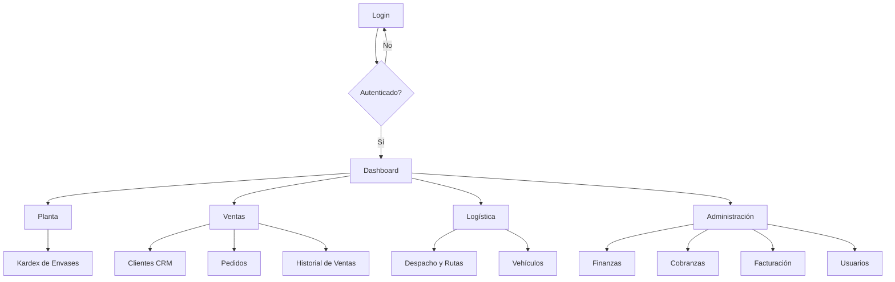

---

## 4.6 Web Applications UX/UI Design

### 4.6.1 Wireframes
*   **Dashboard:** Layout de 3 columnas con KPIs superiores, gráficos de tendencia en el centro y listado de stock bajo a la derecha. [MOCKUP PLACEHOLDER]
*   **Gestión de Pedidos:** Tabla de ancho completo con filtros laterales y acciones rápidas para "Asignar a Ruta". [MOCKUP PLACEHOLDER]
*   **Facturación:** Panel de consolidación con selección de múltiples ventas y pre-visualización de totales antes de emitir a SUNAT. [MOCKUP PLACEHOLDER]

### 4.6.2 Wireflow Diagrams

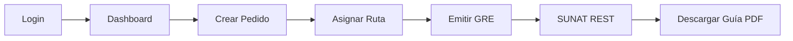

### 4.6.3 Mock-ups
| Pantalla | Descripción | Link Figma |
| :--- | :--- | :--- |
| Login | Interfaz limpia con logo central y campos de credenciales. | [PLACEHOLDER] |
| Dashboard | Panel con gráficos de Recharts y KPIs operativos. | [PLACEHOLDER] |
| CRM | Listado de clientes con mapa de ubicaciones integrado. | [PLACEHOLDER] |
| Facturación | Panel de control de documentos electrónicos y estados SUNAT. | [PLACEHOLDER] |

### 4.6.4 User Flow Diagrams

#### Rol: Administrador
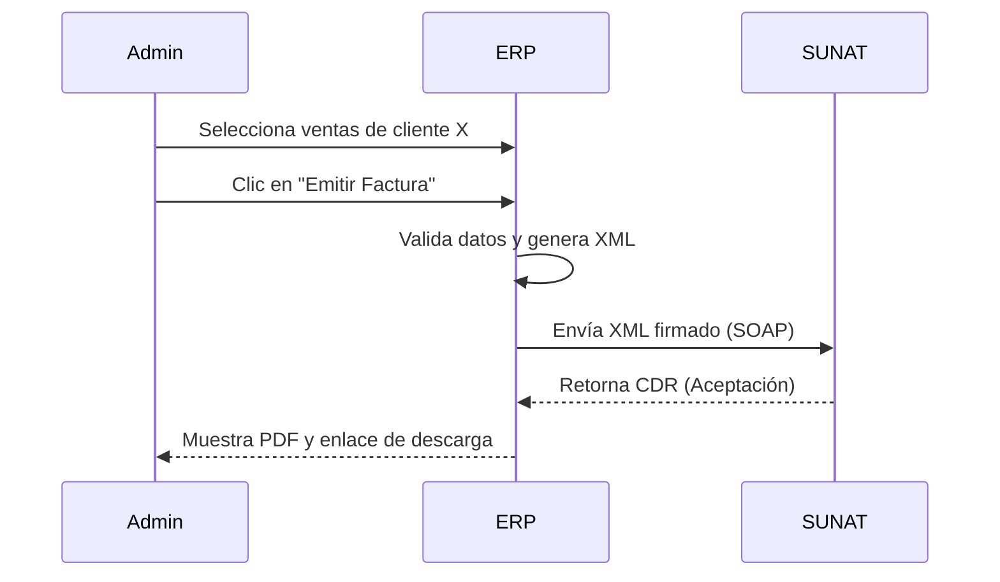

---

## 4.8 Domain-Driven Software Architecture

### 4.8.1 Context Diagram (C4 Nivel 1)
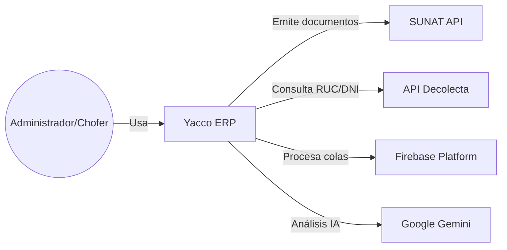

### 4.8.2 Container Diagram (C4 Nivel 2)
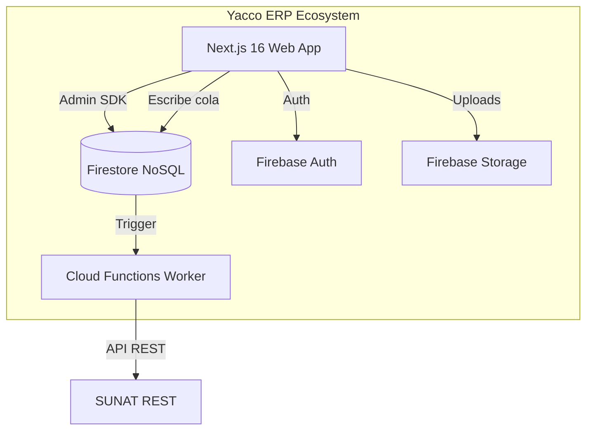

### 4.8.3 Components Diagram (C4 Nivel 3 - Facturación)
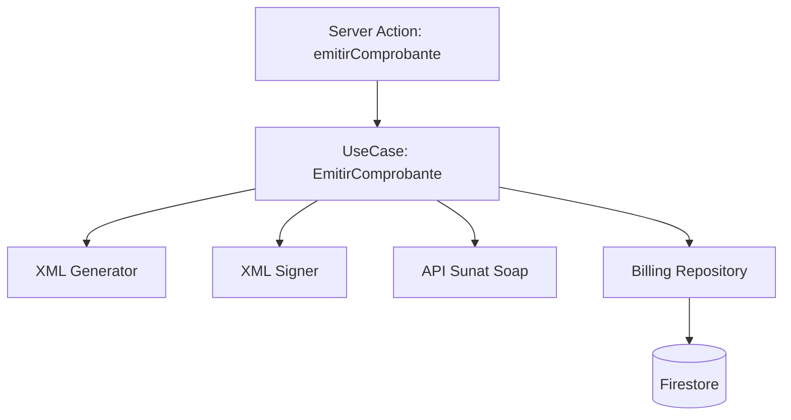

---

## 4.9 Software Object-Oriented Design

### 4.9.1 Class Diagrams
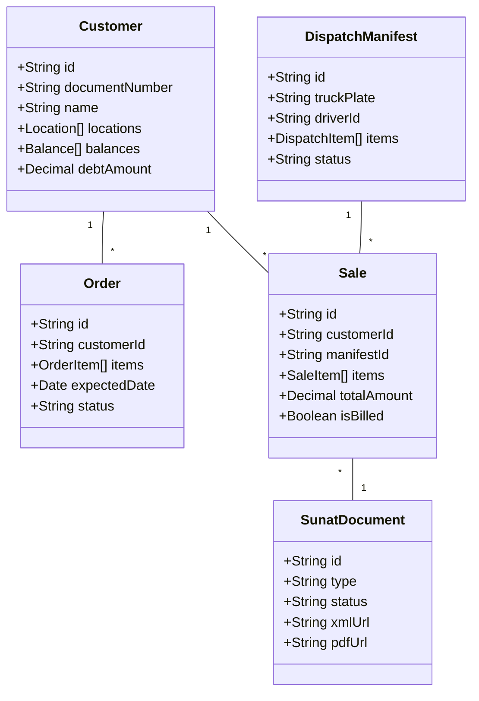

### 4.9.2 Class Dictionary

| Entidad | Atributo | Tipo | Descripción |
| :--- | :--- | :--- | :--- |
| **Customer** | `documentNumber` | String | RUC o DNI del cliente. |
| **Order** | `status` | Enum | PENDING, ASSIGNED, DELIVERED, CANCELLED. |
| **Sale** | `totalAmount` | Decimal | Monto total de la venta incluyendo IGV. |
| **DispatchManifest** | `truckPlate` | String | Placa del vehículo asignado a la ruta. |
| **SunatDocument** | `type` | String | 01 (Factura), 03 (Boleta), 09 (GRE). |

---

## 4.10 Database Design

### 4.10.1 Diagrama de Base de Datos (Firestore)
Aunque Firestore es una base de datos NoSQL documental, se presenta a continuación el modelo de relaciones lógicas mediante referencias por ID.

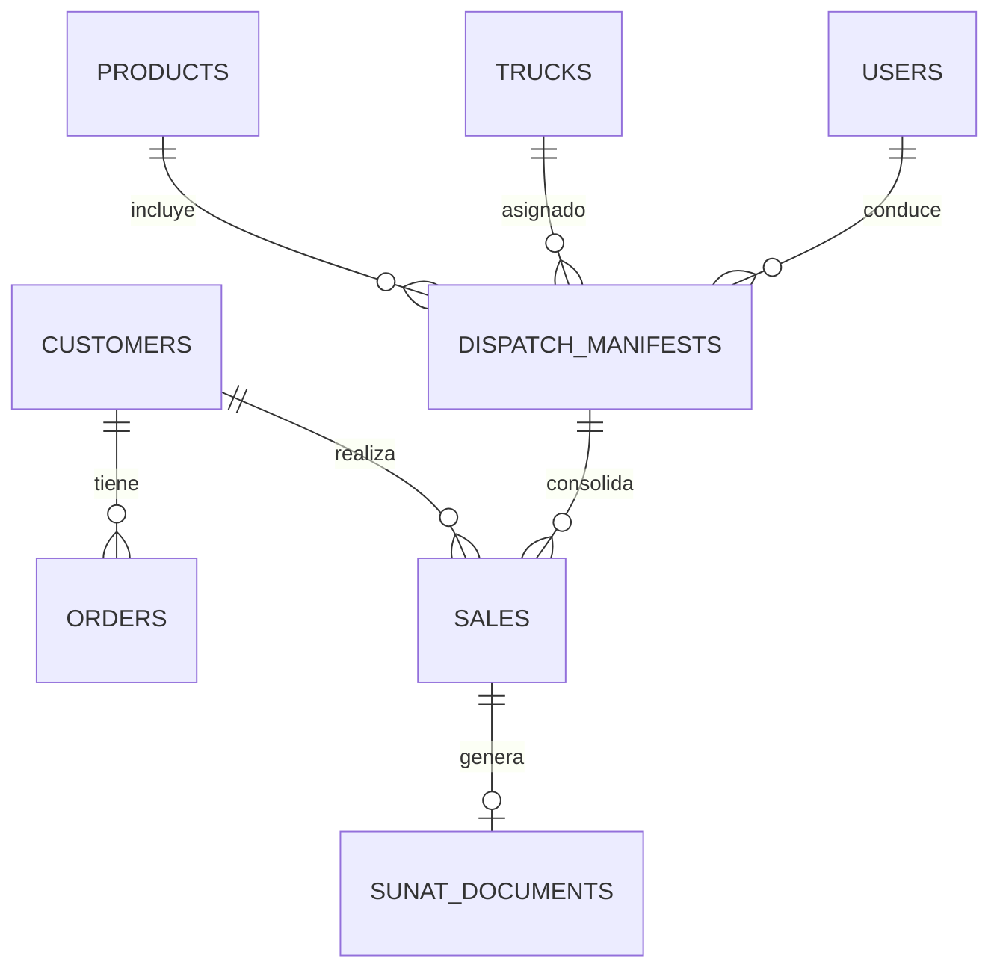


\newpage

# Capítulo V: Implementación

## 5.1 Software Configuration Management

### 5.1.1 Dev Environment Config
El entorno de desarrollo de Yacco ERP ha sido estandarizado para garantizar la paridad entre los puestos de trabajo de los desarrolladores y los entornos de ejecución en la nube.

| Herramienta | Versión | Propósito |
| :--- | :--- | :--- |
| **Node.js** | 20.x (LTS) | Runtime principal del servidor y herramientas de build. |
| **npm** | 10.x+ | Gestor de paquetes y ejecución de scripts. |
| **TypeScript** | 5.x | Lenguaje de programación con tipado estático. |
| **Next.js** | 16.2.6 (App Router) | Framework React para la aplicación web full-stack. |
| **Firebase CLI** | 13.x+ | Gestión de servicios cloud (Hosting, Firestore, Functions). |
| **Firebase Emulators** | - | Pruebas locales de base de datos, auth y funciones. |

**Scripts Principales (`package.json`):**
*   `npm run dev`: Inicia el servidor de desarrollo de Next.js.
*   `npm run build`: Genera el bundle optimizado para producción.
*   `npm run emulate`: Inicia simultáneamente los emuladores de Firebase y Next.js.

### 5.1.2 Source Code Management
Se utiliza **Git** como sistema de control de versiones, siguiendo una estrategia de ramificación basada en *GitFlow* simplificado para despliegue continuo.

*   **Ramas principales:**
    *   `main`: Rama de producción protegida. Contiene código estable y desplegado.
    *   `develop`: Rama de integración donde se consolidan las nuevas funcionalidades.
*   **Ramas temporales:**
    *   `feat/US-XXX-nombre`: Para nuevas historias de usuario.
    *   `fix/BUG-XX-nombre`: Para corrección de errores críticos.

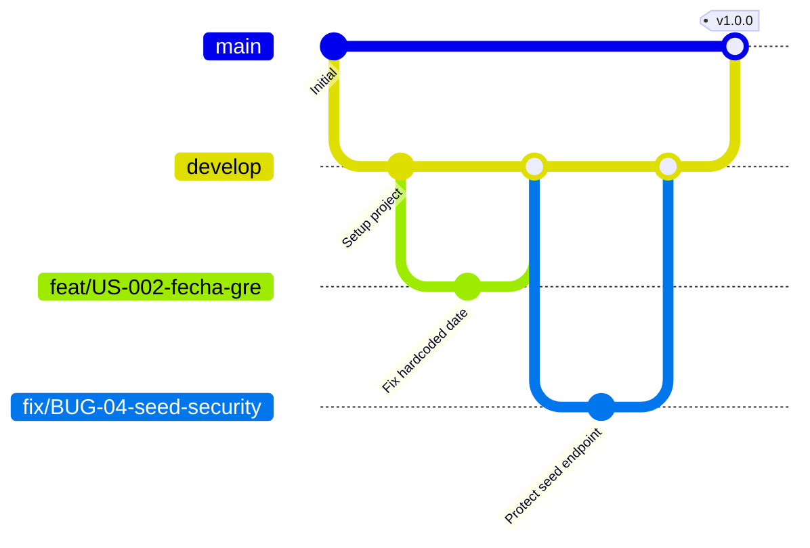

### 5.1.3 Source Code Style Guide & Conventions
El equipo se rige por las normas detalladas en `docs/CONTRIBUTING.md`. Los puntos clave incluyen:
*   **Arquitectura Limpia:** Separación estricta entre `core/entities` (dominio) y `services/repositories` (infraestructura).
*   **Server Actions Pattern:** Uso de `"use server"` con validación obligatoria vía Zod.
*   **Tipado Estricto:** Prohibición del uso de `any` sin justificación técnica y comentario de TODO.
*   **Naming:** `PascalCase` para componentes React y `camelCase` para funciones y servicios.

### 5.1.4 Deployment Config
El despliegue está automatizado mediante un pipeline de CI/CD que integra Vercel y Firebase.

*   **Vercel:** Aloja la aplicación web Next.js (App Router).
*   **Firebase:** Provee la base de datos (Firestore), almacenamiento de archivos (Storage) y procesos de fondo (Cloud Functions).
*   **Pipeline:**
    1.  Push a `develop` o `main`.
    2.  Ejecución de `npm run build` en Vercel.
    3.  Validación de variables de entorno (Secretos).
    4.  Despliegue de Cloud Functions vía Firebase CLI.

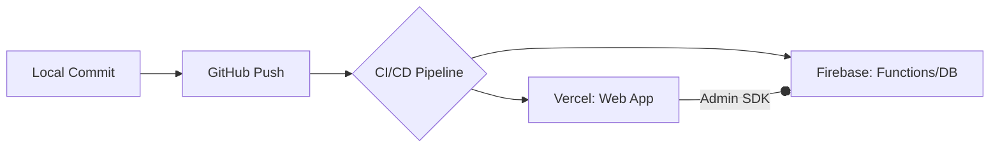

---

## 5.2 Implementation por Sprint

### 5.2.1 Sprint 1: Estabilización y Seguridad
*   **Sprint Planning:**
    *   **Objetivo:** Eliminar riesgos tributarios y brechas de seguridad críticas.
    *   **Capacidad:** 8 Story Points (SP).
    *   **Historias:** US-002, US-003, US-004, US-005.
*   **Sprint Backlog:**
    | ID | Tarea Técnica | SP | Estado |
    | :--- | :--- | :---: | :---: |
    | US-002 | Reemplazar fecha hardcodeada por `new Date()` en GRE. | 1 | Finalizado |
    | US-003 | Implementar bloqueo de `/api/seed` en producción y validación de token. | 2 | Finalizado |
    | US-004 | Extraer URLs de SUNAT a variables de entorno (.env). | 2 | Pendiente |
    | US-005 | Implementar logger estructurado y filtrar datos sensibles. | 3 | Pendiente |
*   **Development Evidence:** [EVIDENCIA PLACEHOLDER: Captura de commits US-002/003]
*   **Execution Evidence:** [EVIDENCIA PLACEHOLDER: Captura de pantalla 404 en /api/seed en producción]
*   **Software Deployment Evidence:** [EVIDENCIA PLACEHOLDER: Panel de Vercel con logs de build]

### 5.2.2 Sprint 2: Worker SUNAT Real
*   **Sprint Planning:**
    *   **Objetivo:** Lograr que la emisión de guías de remisión sea real ante SUNAT.
    *   **Historias:** US-201, US-202.
    *   **Capacidad comprometida:** 16 SP.
*   **Sprint Backlog:**
    | ID | Tarea Técnica | SP | Estado |
    | :--- | :--- | :---: | :---: |
    | US-201 | Configurar npm workspaces y paquete `sunat-core`. | 8 | Pendiente |
    | US-202 | Conectar Cloud Function con API REST de SUNAT. | 8 | Pendiente |
*   **Services Documentation Evidence:** Se documentó la integración con la API REST de SUNAT para Guías de Remisión (GRE) usando OAuth2. [EVIDENCIA PLACEHOLDER: Captura de logs de Cloud Functions enviando GRE]

### 5.2.3 Sprint 3: Calidad y Testing
*   **Sprint Planning:**
    *   **Objetivo:** Asegurar la integridad de los generadores XML y el monitoreo de estados.
    *   **Historias:** US-203, US-301, US-302.
    *   **Capacidad comprometida:** 13 SP.
*   **Testing Suite Evidence:** [EVIDENCIA PLACEHOLDER: Captura de `npm test` con Vitest pasando tests de XML]

### 5.2.4 Sprint 4: Refactor Clean Architecture
*   **Sprint Planning:**
    *   **Objetivo:** Desacoplar la lógica de negocio de los componentes de UI y Server Actions.
    *   **Historias:** US-101, US-102, US-105.
    *   **Capacidad comprometida:** 16 SP.
*   **Execution Evidence:** [EVIDENCIA PLACEHOLDER: Captura de pantalla del panel de facturación consolidada]

---

## 5.3 Validation Interviews

### 5.3.1 Diseño de entrevista de validación
Objetivo: Evaluar si el sistema Yacco ERP resuelve los dolores operativos identificados en el Capítulo II.

1. ¿Qué tan sencillo le resultó encontrar la opción para emitir una factura de una venta anterior?
2. En una escala del 1 al 5, ¿cuánto tiempo cree que ahorra con la generación automática de la Guía de Remisión?
3. ¿Tuvo alguna confusión al momento de registrar el retorno de envases vacíos?
4. ¿Considera que la información mostrada en el Dashboard es suficiente para el cierre de caja diario?
5. ¿Qué opina de la velocidad de respuesta del sistema al interactuar con SUNAT?
6. Si tuviera que eliminar una funcionalidad por ser compleja, ¿cuál sería?
7. ¿Se siente seguro de que el sistema cumple con las normativas tributarias actuales?

### 5.3.2 Registro de entrevistas
| Usuario | Rol | Resultado | Link |
| :--- | :--- | :--- | :--- |
| [PLACEHOLDER 23] | Administrador | [PLACEHOLDER 24] | [PLACEHOLDER 25] |
| [PLACEHOLDER 26] | Chofer | [PLACEHOLDER 27] | [PLACEHOLDER 28] |

### 5.3.3 Evaluación de Heurísticas de Nielsen
| Heurística | Hallazgo | Severidad (0-4) |
| :--- | :--- | :---: |
| 1. Visibilidad del estado del sistema | Barra de progreso real en la emisión a SUNAT. | 0 |
| 2. Relación sistema vs mundo real | Uso de términos como "Bidón" y "Ubigeo". | 0 |
| 3. Control y libertad del usuario | Botón de "Anular" antes de enviar a SUNAT. | 1 |
| 4. Consistencia y estándares | Uso consistente de shadcn/ui en todos los módulos. | 0 |
| 5. Prevención de errores | Bloqueo de facturación si el RUC es inválido. | 0 |
| 6. Reconocimiento antes que recuerdo | Menú lateral siempre visible con iconos claros. | 0 |
| 7. Flexibilidad y eficiencia | Atajos de teclado en el buscador de productos. | 1 |
| 8. Estética y diseño minimalista | Interfaz industrial, sin distracciones. | 0 |
| 9. Ayuda y recuperación | Mensajes de error de SUNAT traducidos a lenguaje humano. | 1 |
| 10. Ayuda y documentación | [PLACEHOLDER: Hallazgo en sección de ayuda] | 2 |

---

## 5.4 Video About-the-Product
[PLACEHOLDER: Link al video en YouTube/Drive]

### Storyboard sugerido:
1.  **Escena 1 (Problema):** El administrador Gerardo rodeado de papeles y cuadernos, estresado por el cierre de caja.
2.  **Escena 2 (Solución):** Introducción de Yacco ERP. Gerardo abre la aplicación en su laptop.
3.  **Escena 3 (Demo Facturación):** Demo de consolidación de 3 ventas en una sola factura con 1 clic.
4.  **Escena 4 (Demo Logística):** El chofer Raúl en su camión abriendo la GRE en su tablet.
5.  **Escena 5 (Impacto):** Gerardo y Raúl finalizando la jornada a tiempo, con caja cuadrada y SUNAT al día.


\newpage

# Capítulo VI: Verificación y Validación

## 6.1 Testing Suites & Validation

La estrategia de pruebas de Yacco ERP se basa en la pirámide de automatización, priorizando las pruebas unitarias de lógica de negocio y los generadores XML de SUNAT para garantizar la integridad tributaria.

### 6.1.1 Core Entities Unit Tests
A continuación, se presenta el diseño de las pruebas unitarias para las entidades del dominio. La implementación técnica de estas pruebas está vinculada a las historias **US-301** y **US-302**.

| Entidad | Caso de Prueba | Input | Resultado Esperado |
| :--- | :--- | :--- | :--- |
| **Customer** | Validación de RUC inválido. | `documentNumber: "123"` | Error de validación (Zod/Entity). |
| **Order** | Cálculo de saldo de envases al crear pedido. | 10 bidones entregados, 2 devueltos. | Saldo acumulado: +8 envases. |
| **Sale** | Cálculo de totales e IGV (18%). | Subtotal: 100.00 | Total: 118.00, IGV: 18.00. |
| **SunatDocument** | Determinación de serie por tipo. | `type: "01"` (Factura) | Serie inicia con "F" (ej. F001). |

**Ejemplo ilustrativo de test (Vitest):**
```ts
// src/core/entities/__tests__/Sale.test.ts
// [PLACEHOLDER: Implementación real vinculada a US-302]
test('debe calcular el IGV correctamente', () => {
  const sale = { items: [{ qty: 1, price: 100 }] };
  expect(calculateTotals(sale).igv).toBe(18);
});
```

### 6.1.2 Core Integration Tests
Se han diseñado pruebas de integración para validar la comunicación entre el dominio y la infraestructura (Firebase/SUNAT).

*   **Flujo de Emisión de Comprobante:** Valida que el `EmitirComprobanteUseCase` coordine correctamente el repositorio de ventas, el generador XML, el firmador digital y el cliente SOAP de SUNAT.
*   **Registro de Venta en Ruta:** Valida la atomicidad de la transacción (creación de venta, actualización de deuda del cliente y descuento de stock en el camión).

**Evidencia de ejecución:**
[EVIDENCIA PLACEHOLDER: Reporte de cobertura de Vitest y logs de integración con Firebase Emulator]

### 6.1.3 Behavior-Driven Development (BDD)
Se definen escenarios en formato Gherkin para validar el comportamiento del sistema desde la perspectiva del usuario.

**Feature: Facturación de Ventas Consolidadas**
*   **Scenario:** Emitir una factura para múltiples ventas del mismo cliente.
    *   **Given** que el administrador ha seleccionado tres ventas completadas del cliente "Agua Pura S.A.".
    *   **When** el administrador presiona el botón "Emitir Factura".
    *   **Then** el sistema debe generar un único documento XML UBL 2.1 con el detalle de las tres ventas y recibir el CDR de aceptación de SUNAT.

**Feature: Emisión de Guía de Remisión (GRE)**
*   **Scenario:** Generación automática de GRE al asignar ruta.
    *   **Given** un manifiesto de despacho con estado "PENDING".
    *   **When** el administrador asigna un chofer y un camión al manifiesto.
    *   **Then** el worker de background debe emitir la GRE a la API REST de SUNAT y generar el PDF con código QR.

### 6.1.4 System Tests
Pruebas de extremo a extremo (E2E) que simulan el uso real por roles:

*   **Rol Administrador:** Login -> Carga de stock -> Armado de ruta -> Emisión de Factura -> Cierre de caja.
*   **Rol Chofer:** Ver ruta asignada -> Registrar entrega de 5 bidones -> Recoger 3 envases vacíos -> Finalizar ruta.

**Evidencia de ejecución:**
[EVIDENCIA PLACEHOLDER: Video o capturas de flujo completo en entorno de Staging]

---

## 6.2 Static Testing & Verification

### 6.2.1 Static Code Analysis

#### 6.2.1.1 Coding standard & conventions
El proyecto utiliza **ESLint** con la configuración oficial de Next.js (`eslint-config-next`), complementada con las reglas de estilo definidas en `CONTRIBUTING.md`. El tipado estricto es forzado mediante el compilador de TypeScript (`tsc`).

#### 6.2.1.2 Code Quality & Security
Se han establecido las siguientes métricas y herramientas de verificación:
*   **Tooling:** ESLint para linting, `tsc --noEmit` para verificación de tipos, y **gitleaks** para prevención de fuga de credenciales.
*   **Métricas Objetivo:** 0 errores de lint, 0 warnings de tipo en ramas `main` y `develop`.
*   **Deuda Técnica Detectada:** Se han vinculado los hallazgos de la auditoría inicial (`docs/REVISION-CODIGO.md`) como puntos de mejora obligatorios, tales como la eliminación de usos de `any` (BUG-06) y la protección de logs sensibles (BUG-11).

**Resultados del Análisis Estático:**
[EVIDENCIA PLACEHOLDER: Captura de pantalla de la ejecución de `npm run lint` sin errores]

### 6.2.2 Reviews
El proceso de verificación por pares (Peer Review) es obligatorio para cualquier cambio en la lógica de negocio. Se utiliza el checklist definido en `CONTRIBUTING.md` §11, enfocándose en:
*   Cumplimiento de la arquitectura limpia (Casos de Uso aislados).
*   Correcto manejo de errores de SUNAT.
*   Ausencia de datos sensibles en el código.

---

## 6.3 Validation Interviews

### 6.3.1 Diseño de entrevista de verificación y validación (V&V)
Objetivo: Validar la confiabilidad y calidad técnica percibida por los usuarios expertos.

1. ¿Considera que el proceso de firma digital y envío a SUNAT es transparente y confiable?
2. ¿Qué tan rápido puede identificar si un documento fue rechazado por SUNAT y el motivo del error?
3. ¿Ha notado alguna inconsistencia entre los datos registrados en la venta y los que figuran en el comprobante electrónico?
4. ¿El sistema previene correctamente la emisión de guías si faltan datos críticos como el peso o el ubigeo?
5. ¿Qué tan seguro se siente respecto a la privacidad de los tokens y certificados manejados por el sistema?
6. ¿El flujo de "Liquidación de Caja" le da la seguridad de que no hay pérdida de dinero o envases?

### 6.3.2 Registro de entrevistas
| Entrevistador | Usuario / Rol | Fecha | Hallazgo Clave |
| :--- | :--- | :--- | :--- |
| [PLACEHOLDER 29] | [PLACEHOLDER 30] | [PLACEHOLDER 31] | [PLACEHOLDER 32] |

### 6.3.3 Evaluación de Heurísticas de Nielsen (Final)
[Plantilla de evaluación consolidada tras las pruebas de validación final].

| Heurística | Hallazgo Detectado | Severidad | Acción de Mejora |
| :--- | :--- | :---: | :--- |
| H1: Visibilidad | [PLACEHOLDER] | - | - |
| H2: Mundo real | [PLACEHOLDER] | - | - |
| ... | ... | - | - |

---

## 6.4 Auditoría de Experiencias de Usuario

### 6.4.1 Auditoría realizada (Por el equipo Yacco)
Documentación de la auditoría externa realizada a otro grupo del curso.

*   **Info del grupo auditado:** [PLACEHOLDER 33: Nombre del proyecto y grupo]
*   **Cronograma:** [PLACEHOLDER 34: Fechas de la auditoría]
*   **Contenido:** [PLACEHOLDER 35: Resumen de hallazgos encontrados en el proyecto auditado]

### 6.4.2 Auditoría recibida (A Yacco ERP)
Documentación de los resultados y mejoras aplicadas tras recibir una auditoría externa.

*   **Info del grupo auditor:** [PLACEHOLDER 36: Nombre del grupo auditor]
*   **Cronograma:** [PLACEHOLDER 37]
*   **Hallazgos Principales:** [PLACEHOLDER 38: Lista de bugs o mejoras UI sugeridas]
*   **Resumen de modificaciones:** [PLACEHOLDER 39: Cambios realizados en el código o documentación tras la auditoría]


\newpage

# Capítulo VII: DevOps y Operaciones

## 7.1 Continuous Integration

### 7.1.1 Tools and Practices
La integración continua (CI) asegura que el código principal permanezca en un estado desplegable. El flujo se basa en un modelo *Trunk-based* adaptado, utilizando `develop` como rama principal de integración antes de pasar a `main`.

*   **Herramienta:** GitHub Actions [VERIFICAR].
*   **Trigger:** Push o Pull Request hacia las ramas `develop` y `main`.
*   **Prácticas automatizadas:**
    1.  **Linting:** Ejecución de `eslint` (usando `eslint-config-next`) para garantizar convenciones de código.
    2.  **Type-checking:** Verificación estricta de tipos de TypeScript (`tsc --noEmit`).
    3.  **Testing:** Ejecución de la suite de pruebas unitarias con Vitest (referencia a la historia **US-301**).
    4.  **Build:** Compilación de la aplicación Next.js (`npm run build`) para detectar errores de sintaxis o empaquetado.

### 7.1.2 Build & Test Suite Pipeline Components
A continuación, el diagrama del pipeline de integración continua:

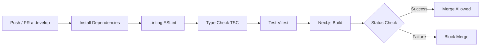

**Ejemplo propuesto del Workflow CI (`.github/workflows/ci.yml`):**
```yaml
name: CI Pipeline

on:
  push:
    branches: [ "develop", "main" ]
  pull_request:
    branches: [ "develop", "main" ]

jobs:
  build-and-test:
    runs-on: ubuntu-latest
    steps:
      - uses: actions/checkout@v4
      
      - name: Setup Node.js
        uses: actions/setup-node@v4
        with:
          node-version: '20'
          cache: 'npm'
          
      - name: Install dependencies
        run: npm ci
        
      - name: Lint
        run: npm run lint
        
      - name: Type Check
        run: npx tsc --noEmit
        
      - name: Test
        run: npm test # Asume configuración de Vitest
        
      - name: Build Next.js
        run: npm run build
```
[EVIDENCIA PLACEHOLDER 40: Captura de la corrida exitosa de GitHub Actions en un PR]

---

## 7.2 Continuous Delivery

### 7.2.1 Tools and Practices
La entrega continua (CD - Delivery) automatiza el despliegue del código hacia entornos previos a producción, permitiendo pruebas manuales y validación de Stakeholders.

*   **Hosting Frontend:** Vercel [VERIFICAR]. Genera *Preview Deployments* automáticos por cada Pull Request.
*   **Backend:** Firebase CLI ejecutado mediante GitHub Actions para desplegar reglas de Firestore y Cloud Functions en el entorno de *Staging*.
*   **Gate de Aprobación:** El pase a producción (rama `main`) requiere un *Code Review* aprobado y validación manual del Product Owner.

### 7.2.2 Stages Deployment Pipeline Components

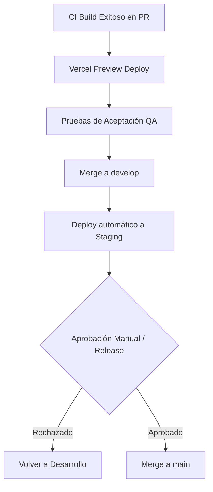
[EVIDENCIA PLACEHOLDER 41: Capturas de panel de Vercel mostrando Preview Deployments]

---

## 7.3 Continuous Deployment

### 7.3.1 Tools and Practices
El despliegue continuo (CD - Deployment) automatiza la salida a producción una vez que el código se fusiona a `main`.

*   **Frontend (Vercel):** Configurado para realizar un "Auto-deploy" directo al entorno de Producción al detectar cambios en `main`.
*   **Backend (Firebase):** Una GitHub Action independiente despliega las Cloud Functions (`firebase deploy --only functions`) y sincroniza los índices/reglas de Firestore.
*   **Rollback Strategy:** Vercel permite regresiones instantáneas a versiones anteriores desde su panel (Instant Rollback).
*   **Migraciones:** Las reglas de seguridad (`firestore.rules`) y los índices (`firestore.indexes.json`) se mantienen bajo control de versiones y se despliegan junto con las funciones.

### 7.3.2 Production Deployment Pipeline Components

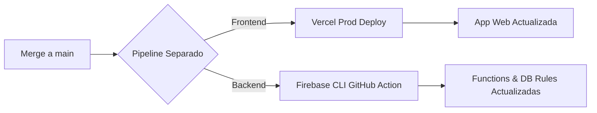
*(Nota: A diferencia del Continuous Delivery donde hay un Gate manual, el Continuous Deployment a Producción es automático tras el merge a `main`).*

---

## 7.4 Continuous Monitoring

### 7.4.1 Tools and Practices
Dado el riesgo detectado en la dependencia crítica de SUNAT (latencia o caídas gubernamentales), el monitoreo es vital.

*   **Vercel Analytics:** Monitoreo del tráfico web, Web Vitals y errores de la aplicación de usuario.
*   **Firebase Crashlytics / Performance:** Trazabilidad de fallos en el cliente móvil/web y latencia en consultas a Firestore.
*   **Log estructurado:** Como se define en la historia **US-005**, los logs de las funciones (que envían comprobantes) se supervisarán desde el panel nativo de GCP/Firebase Logs.

### 7.4.2 Monitoring Pipeline Components

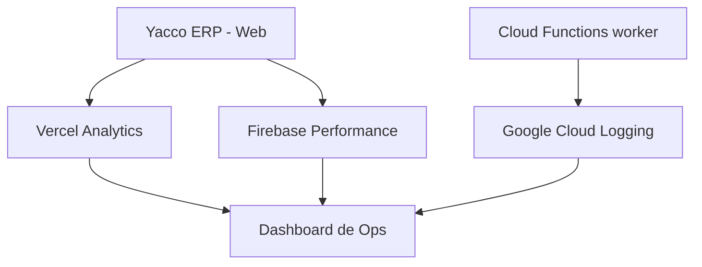

**Métricas Clave a Observar:**
1.  **Tasa de éxito SUNAT:** Proporción de comprobantes aceptados (status: `ACCEPTED`) vs rechazados (`REJECTED`).
2.  **Profundidad de la Cola:** Número de tareas en `sunatQueue` con estado `ERROR` o estancadas en `PROCESSING`.
3.  **Tiempo de respuesta REST/SOAP:** Latencia promedio de `apiSunatRest` al enviar GREs.

### 7.4.3 Alerting
Alineado con los riesgos técnicos del negocio, se proponen las siguientes alertas automáticas:

| Condición (Síntoma) | Umbral Crítico | Canal de Notificación |
| :--- | :--- | :--- |
| **Rechazos SUNAT (CDR 99)** | > 5% de documentos en 1 hora. | Alerta SMS / Slack (Canal #sunat-urgente) |
| **Cola de SUNAT atascada** | Tareas en `PENDING` por > 30 mins. | Slack / Email (Equipo de Dev) |
| **Errores de Red (Timeouts)** | > 10 fallos 5xx seguidos. | Slack (Equipo de Dev) |
| **Certificado Digital por vencer** | Menos de 30 días de vigencia. | Email a Gerencia y Soporte Técnico |

### 7.4.4 Notification Pipeline

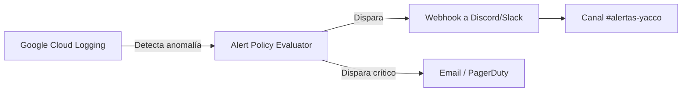

> **Nota Técnica:** La implementación formal de este esquema de Monitoreo y Alertas no se encuentra actualmente en el `docs/BACKLOG.md`. Se recomienda la creación de una nueva Épica técnica ("Observabilidad") y una Historia de Usuario (ej. **US-701: Setup de Alertas SUNAT**) para abarcar este esfuerzo en un sprint posterior.


\newpage

# Capítulo VIII: Desarrollo Impulsado por Experimentos

> **Declaración de Supuesto Raíz:** El equipo de desarrollo de Yacco ERP busca validar si la automatización de la facturación electrónica ante SUNAT y la generación desatendida de Guías de Remisión Remitente (GRE) reduce el tiempo operativo administrativo en al menos un 70% y disminuye los errores de validación tributaria a menos del 2%, en comparación con el proceso manual actual de Moalv S.A.C. **[SUPUESTO base]**.

## 8.1 Experiment Planning

### 8.1.1 As-Is Summary
Actualmente, Moalv S.A.C. gestiona el despacho de agua mediante registros manuales en cuadernos y hojas de cálculo. La facturación electrónica se realiza de forma reactiva (muchas veces días después de la entrega) y las Guías de Remisión se llenan a mano o mediante sistemas externos desvinculados del inventario real. Esto genera cuellos de botella en la liquidación de caja al final del día y una alta probabilidad de inconsistencias ante SUNAT.

### 8.1.2 Raw Material

**Assumptions (Supuestos):**
*   El administrador pierde aproximadamente 10 horas semanales consolidando ventas manualmente para facturar. **[SUPUESTO]**
*   Los choferes olvidan registrar el retorno del 15% de los envases vacíos debido a la falta de una herramienta móvil. **[SUPUESTO]**
*   SUNAT rechaza el 5% de los documentos por errores de digitación en el ubigeo o peso. **[SUPUESTO]**
*   La latencia de la API de SUNAT no afectará el flujo de salida del camión si se procesa de forma asíncrona.

**Knowledge Gaps (Vacíos de conocimiento):**
*   ¿Cuál es el tiempo exacto que toma emitir un comprobante desde que se selecciona la venta hasta que se obtiene el CDR?
*   ¿Cuántos intentos fallidos de conexión a la API de SUNAT ocurren en una jornada típica?
*   ¿Cuál es el nivel de adopción digital real de los repartidores con la interfaz web responsiva?

**Ideas:**
*   Implementar un dashboard de métricas en tiempo real que compare "Ventas Realizadas" vs "Ventas Facturadas".
*   Crear un sistema de alertas vía WhatsApp/Email cuando un documento sea rechazado por SUNAT.
*   Utilizar IA (Gemini) para predecir la ruta más eficiente basándose en el historial de entregas.

**Claims:**
*   "La automatización total eliminará las multas por emisión fuera de plazo".
*   "Yacco ERP permitirá a Moalv manejar un 20% más de volumen de ventas con el mismo personal administrativo".

### 8.1.3 Experiment-Ready Questions
*   ¿Reducirá la integración asíncrona (cola de tareas) el tiempo de espera del administrador para emitir 50 comprobantes?
*   ¿Es la validación previa de datos (Zod) suficiente para reducir la tasa de rechazo de SUNAT a menos del 1%?
*   ¿Logrará la interfaz móvil de "Retorno de Vacíos" aumentar la precisión del stock de envases en planta?

### 8.1.4 Question Backlog
| Pregunta | Importancia (1-5) | Incertidumbre (1-5) | Score (Imp x Inc) |
| :--- | :---: | :---: | :---: |
| ¿La automatización reduce el tiempo administrativo? | 5 | 2 | 10 |
| ¿La tasa de rechazo SUNAT bajará del 2%? | 5 | 4 | 20 **[SUPUESTO]** |
| ¿Los choferes usarán la App en ruta sin problemas? | 4 | 5 | 20 **[SUPUESTO]** |
| ¿El costo de Firebase escalará con el volumen de ventas? | 3 | 3 | 9 |

### 8.1.5 Experiment Cards

**Card 1: Validación de Tasa de Rechazo SUNAT**
*   **Hipótesis:** Creemos que la validación estricta de esquemas XML (UBL 2.1) antes del envío reducirá los rechazos tributarios.
*   **Método:** Análisis de logs de `sunatQueue` durante 2 semanas.
*   **Métrica:** Porcentaje de documentos con estado `REJECTED`.
*   **Criterio de éxito:** Tasa de rechazo < 1%.
*   **Duración:** 14 días.

**Card 2: Eficiencia Administrativa**
*   **Hipótesis:** Creemos que la consolidación masiva de ventas en un solo comprobante ahorrará horas al administrador Gerardo.
*   **Método:** Observación directa y cronometraje de la liquidación diaria.
*   **Métrica:** Tiempo total empleado en facturación por día.
*   **Criterio de éxito:** Reducción del 50% vs proceso manual.
*   **Duración:** 7 días.

---

## 8.2 Experiment Design

### 8.2.1 Hypotheses
1.  Creemos que al implementar un worker asíncrono para el envío de GRE para los despachadores, lograremos una salida de planta más rápida, medido por el tiempo transcurrido entre "Carga de Camión" y "Salida Real". **[SUPUESTO]**
2.  Creemos que la validación automática de Ubigeos para los clientes nuevos evitará errores de envío REST, medido por la cantidad de errores 400 devueltos por SUNAT. **[SUPUESTO]**

### 8.2.2 Domain Business Metrics
*   **Tasa de Rechazo SUNAT:** Porcentaje de CDRs con código de error.
*   **Tiempo de Facturación:** Segundos desde el clic hasta la generación del PDF.
*   **Exactitud de Kardex:** Discrepancia entre stock físico y stock digital de envases.
*   **Tasa de Cobranza:** Porcentaje de ventas al crédito pagadas en el plazo pactado.

### 8.2.3 Measures
*   **Fuentes de Datos:** Colección `sunatDocuments` (Firestore), Logs de Google Cloud (Cloud Functions), y métricas de Vercel Analytics.
*   **Instrumento:** Script de agregación de datos que calcule la media diaria de estados exitosos vs errores.

### 8.2.4 Conditions
*   **Grupo Control:** Proceso manual (datos históricos de Moalv S.A.C. antes de Yacco).
*   **Grupo Tratamiento:** Uso integral de Yacco ERP en una ruta piloto. **[SUPUESTO]**

### 8.2.5 Scale Calculations and Decisions
Dado que Yacco ERP es una herramienta interna, el tamaño de la muestra es pequeño (*n* = 1-2 administradores, 3-5 choferes). La validación será de tipo **mixta**: cuantitativa para los tiempos de sistema y cualitativa (entrevistas) para la satisfacción del usuario. No se busca significancia estadística masiva, sino validación de utilidad operativa.

### 8.2.6 Methods Selection
Se utilizará el método de **Análisis de Cohortes (Antes/Después)** comparando el rendimiento de la última semana de gestión manual vs la primera semana de uso del sistema.

### 8.2.7 Data Analytics - Goals/KPIs/Metrics
| Goal | KPI | Métrica (Target) |
| :--- | :--- | :--- |
| Reducir errores tributarios | Tasa de Aceptación SUNAT | > 99% de documentos ACCEPTED. |
| Agilizar el despacho | Tiempo de emisión GRE | < 10 segundos por guía. |
| Mejorar flujo de caja | Índice de Morosidad | < 5% de ventas con deuda > 15 días. |

### 8.2.8 Web Tracking Plan (Solo Web)
| Evento | Trigger | Propiedades | Herramienta |
| :--- | :--- | :--- | :--- |
| `invoice_emitted` | Clic en emitir factura | type, total_amount, client_id | Vercel Analytics **[SUPUESTO]** |
| `sunat_error` | Respuesta errónea de SUNAT | error_code, document_type | Firebase Crashlytics |
| `route_liquidated` | Clic en cerrar ruta | total_cash, envases_devueltos | Vercel Analytics |

---

## 8.3 Experimentation

### 8.3.1 To-Be User Stories (Derivadas del aprendizaje)
| ID | Historia de Usuario |
| :--- | :--- |
| **US-801** | **Como** administrador, **quiero** ver un dashboard de errores de SUNAT detallado, **para** corregir datos de clientes rápidamente sin entrar a los logs. |
| **US-802** | **Como** gerente, **quiero** una alerta automática si la cola de SUNAT tiene más de 5 errores pendientes, **para** evitar retrasos legales. |

### 8.3.2 To-Be Product Backlog
1.  **US-801:** Prioridad P1 (Impacto en usabilidad).
2.  **US-802:** Prioridad P2 (Monitoreo proactivo).

### 8.3.3 Pipeline-supported To-Be Lifecycle

#### 8.3.3.1 To-Be Sprint Backlog (Sprint 5: Experimentos)
*   **Tarea 1:** Implementar vista `/admin/sunat-monitoring` (US-801).
*   **Tarea 2:** Integrar Webhook de Slack para alertas de cola (US-802).

#### 8.3.3.2 Landing Page Evidence
**N/A.** Yacco ERP es una aplicación de gestión interna bajo autenticación. No se requiere landing page de adquisición para el experimento actual.

#### 8.3.3.3 Frontend-Web Evidence
[EVIDENCIA PLACEHOLDER 42: Captura de pantalla del nuevo Dashboard de Monitoreo SUNAT].

#### 8.3.3.4 Native-Mobile Evidence
**N/A.** Se utiliza la versión web responsiva para tablets en los camiones. Se descarta desarrollo nativo para este experimento para reducir costos.

#### 8.3.3.5 RESTful API / Serverless Evidence
Se ha propuesto un nuevo endpoint `GET /api/metrics/sunat-health` que consolida los estados de la última hora para el dashboard.
[EVIDENCIA PLACEHOLDER 43: Captura de Postman consumiendo el endpoint de métricas].

### 8.3.4 To-Be Validation Interviews
#### 8.3.4.1 Diseño: Guion de validación post-experimento
1. ¿El sistema le permitió detectar errores de SUNAT antes que el contador se lo notifique?
2. ¿Qué tan útil le parece la nueva alerta de errores en tiempo real?
3. ¿Siente que el control de envases ahora coincide con lo que ve físicamente en el camión?

#### 8.3.4.2 Registro
| Entrevistador | Usuario | Resultado |
| :--- | :--- | :--- |
| [PLACEHOLDER 44] | [PLACEHOLDER 45] | [PLACEHOLDER 46] |

---

## 8.4 Experiment Aftermath & Analysis

### 8.4.1 Analysis / Interpretation
[PLACEHOLDER: Documentar si la automatización redujo efectivamente el tiempo administrativo y si la tasa de rechazo bajó al nivel esperado].

### 8.4.2 Re-scored Question Backlog
[Plantilla para re-evaluar prioridades tras los resultados del experimento].

---

## 8.5 Continuous Learning
### 8.5.1 Shareback Session Artifacts
*   **Lo que aprendimos:** Los errores 403 de SUNAT se debían a falta de permisos en el RUC, no a código.
*   **Lo que cambia:** Se agregará un checklist de requisitos SOL antes de activar un cliente.
*   **Próximo Experimento:** Validar la facturación desatendida mediante "Autofactura" al final de la ruta.

---

## 8.6 To-Be Software Platform Pre-launch
### 8.6.1 About-the-Product Intro Video
[PLACEHOLDER: Link al video de lanzamiento de la plataforma automatizada].

**Storyboard sugerido (Lanzamiento):**
1.  Recapitulación del caos manual anterior.
2.  Muestra de la velocidad de emisión actual.
3.  Testimonio del administrador sobre el tiempo ganado.
4.  Cierre con la visión de "Moalv 100% digital".
